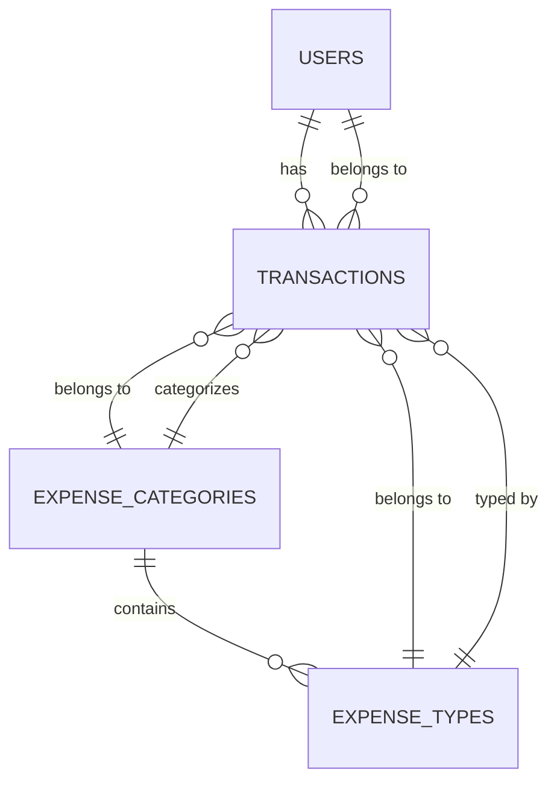

Collecting workspace information# Database Design & Setup - Deep Dive

Based on the selected section from your LoadMap, let me provide a comprehensive explanation of the database design and setup for your Personal Finance Tracker project.

## Why PostgreSQL?

Your project uses **PostgreSQL**, a relational database management system (RDBMS). Here's why it's the right choice:

1. **ACID Compliance**: Ensures your financial transactions are reliable and consistent
2. **Relational Structure**: Perfect for modeling interconnected financial data (users → transactions → categories)
3. **Advanced Features**: Supports complex queries, functions, and stored procedures (as seen in [database/seeds/cashflow/get_financial_overview.sql](Money Tracking/Original Project/database/seeds/cashflow/get_financial_overview.sql))
4. **Data Integrity**: Foreign key constraints prevent orphaned records

---

## Core Database Concepts

### **1. Tables - The Foundation**

Your database has **4 main tables** that work together:

#### **users table** ([database/migrations/20240717120000_add-users-table.sql](Money Tracking/Original Project/database/migrations/20240717120000_add-users-table.sql))

```sql
CREATE TABLE IF NOT EXISTS users (
    id SERIAL PRIMARY KEY,
    email VARCHAR(255) NOT NULL UNIQUE,
    password_hash VARCHAR(255) NOT NULL,
    created_at TIMESTAMP WITH TIME ZONE DEFAULT CURRENT_TIMESTAMP
);
```

**Key concepts:**
- `SERIAL PRIMARY KEY`: Auto-incrementing unique identifier (1, 2, 3...)
- `UNIQUE`: Ensures no two users can have the same email
- `password_hash`: Stores encrypted passwords (never plain text!)
- `TIMESTAMP WITH TIME ZONE`: Tracks when users registered

#### **expense_categories table** ([database/migrations/20240305063418723_create-main-tables.sql](Money Tracking/Original Project/database/migrations/20240305063418723_create-main-tables.sql))

```sql
CREATE TABLE IF NOT EXISTS expense_categories (
    id SERIAL PRIMARY KEY,
    category_name VARCHAR(255) NOT NULL
);
```

**Purpose**: High-level groupings
- Income
- Personal Fixed Costs
- Personal Running Costs
- Housing Fixed Costs
- Travel Costs

#### **expense_types table**

```sql
CREATE TABLE IF NOT EXISTS expense_types (
    id SERIAL PRIMARY KEY,
    type_name VARCHAR(255) NOT NULL,
    category_id INT NOT NULL,
    FOREIGN KEY (category_id) REFERENCES expense_categories(id)
);
```

**Purpose**: Specific types within each category
- Category "Personal Running Costs" contains types like: "Restaurants", "Groceries", "Gym"
- Category "Income" contains: "Salary", "Bonus"

**Key concept - Foreign Key:**
- `category_id` links each type to its parent category
- Database prevents you from creating a type with a non-existent category_id

#### **transactions table** ([database/migrations/20240305063418723_create-main-tables.sql](Money Tracking/Original Project/database/migrations/20240305063418723_create-main-tables.sql))

```sql
CREATE TABLE IF NOT EXISTS transactions (
    id SERIAL PRIMARY KEY,
    date DATE NOT NULL,
    amount DECIMAL(10, 2) NOT NULL,
    type_id INT NOT NULL,
    category_id INT NOT NULL,
    user_id INTEGER,
    FOREIGN KEY (type_id) REFERENCES expense_types(id),
    FOREIGN KEY (category_id) REFERENCES expense_categories(id),
    FOREIGN KEY (user_id) REFERENCES users(id) ON DELETE CASCADE
);
```

**This is your fact table** - where all the action happens:
- `DECIMAL(10, 2)`: Stores money with 2 decimal places (e.g., 1234.56)
- Multiple foreign keys link to users, types, and categories
- `ON DELETE CASCADE`: If a user is deleted, all their transactions are automatically removed

---

## Relationships - How Tables Connect

### **One-to-Many Relationships**

#### 1. **users → transactions** (One user has many transactions)

```
User ID 1 (john@email.com)
    ├── Transaction 1: $50 Groceries
    ├── Transaction 2: $25 Netflix
    └── Transaction 3: $1200 Rent

User ID 2 (jane@email.com)
    ├── Transaction 4: $100 Shopping
    └── Transaction 5: $3000 Salary
```

**Why this matters:**
- Each user's data is isolated
- Query: "Show me all transactions for user_id = 5" ([backend/src/services/feed.service.ts](Money Tracking/Original Project/backend/src/services/feed.service.ts))

#### 2. **expense_categories → expense_types** (One category has many types)

```
Category: Personal Running Costs (id=3)
    ├── Type: Restaurants (id=15)
    ├── Type: Groceries (id=4)
    └── Type: Gym (id=5)

Category: Income (id=1)
    ├── Type: Salary (id=1)
    └── Type: Bonus (id=2)
```

#### 3. **expense_types → transactions** (One type used in many transactions)

```
Type: Restaurants (id=15)
    ├── Transaction: $50 on 2024-01-15
    ├── Transaction: $75 on 2024-01-20
    └── Transaction: $40 on 2024-02-03
```

---

## Database Migrations - Version Control for Your Schema

### **What are Migrations?**

Migrations are SQL scripts that **evolve your database schema over time**, just like Git tracks code changes.

### **Migration File Structure** ([database/migrations/](Money Tracking/Original Project/database/migrations/))

Your project has 3 migration files (executed in chronological order):

1. **20240305063418723_create-main-tables.sql**
   - Creates: `expense_categories`, `expense_types`, `transactions`
   - Seeds initial category/type data

2. **20240305063429859_create-data-model.sql**
   - Inserts sample transaction data
   - Demonstrates proper data structure

3. **20240717120000_add-users-table.sql**
   - Adds `users` table
   - Adds `user_id` column to `transactions`
   - Creates foreign key constraint

### **Migration Anatomy**

```sql
-- Up Migration (Creates/modifies database)
BEGIN;

CREATE TABLE IF NOT EXISTS users (
    id SERIAL PRIMARY KEY,
    email VARCHAR(255) NOT NULL UNIQUE,
    password_hash VARCHAR(255) NOT NULL,
    created_at TIMESTAMP WITH TIME ZONE DEFAULT CURRENT_TIMESTAMP
);

COMMIT;

-- Down Migration (Reverses changes)
BEGIN;
DROP TABLE IF EXISTS users;
COMMIT;
```

**Key concepts:**
- `BEGIN;` and `COMMIT;`: Ensures all changes succeed or none do (transaction safety)
- `IF NOT EXISTS`: Prevents errors if run multiple times
- **Up**: Run when deploying new features
- **Down**: Run when rolling back changes

### **How Migrations are Executed** ([database/src/runner.ts](Money Tracking/Original Project/database/src/runner.ts))

```typescript
function findSqlFiles(dir: string, fileList: string[] = []): string[] {
  const files = fs.readdirSync(dir);
  
  files.forEach(file => {
    const filePath = path.join(dir, file);
    if (fs.statSync(filePath).isDirectory()) {
      findSqlFiles(filePath, fileList); // Recursively find SQL files
    } else if (path.extname(file) === '.sql') {
      fileList.push(filePath); // Collect all .sql files
    }
  });
  
  return fileList;
}
```

**The migration runner:**
1. Scans [database/migrations/](Money Tracking/Original Project/database/migrations/) and [database/seeds/](Money Tracking/Original Project/database/seeds/)
2. Sorts files by timestamp in filename (20240305... comes before 20240717...)
3. Executes each SQL file in order
4. Tracks which migrations have been applied (prevents re-running)

---

## Data Model Visualization

Looking at the referenced [images/financeDM.png](Money Tracking/Original Project/images/financeDM.png), here's the **Entity-Relationship Diagram**:



**Reading the diagram:**
- `||--o{` means "one-to-many"
- A user can have many transactions, but each transaction belongs to one user
- A transaction references both a category (for grouping) and a type (for specificity)

---

## Sample Data Flow

Let's trace what happens when you insert this transaction (from [database/migrations/20240305063429859_create-data-model.sql](Money Tracking/Original Project/database/migrations/20240305063429859_create-data-model.sql)):

```sql
INSERT INTO transactions (id, date, amount, type_id, category_id)
VALUES (66, '2024-02-09', 43.00, 15, 3);
```

**What this means:**
1. Transaction ID: 66
2. Date: February 9, 2024
3. Amount: 43.00 DKK
4. `type_id = 15` → Looks up in `expense_types` → "Restaurants"
5. `category_id = 3` → Looks up in `expense_categories` → "Personal Running Costs"

**Result**: "Spent 43 DKK at a restaurant on Feb 9, categorized as Personal Running Costs"

---

## SQL Functions - Advanced Database Logic

Your project includes PostgreSQL functions that perform complex calculations ([database/seeds/cashflow/get_financial_overview.sql](Money Tracking/Original Project/database/seeds/cashflow/get_financial_overview.sql)):

```sql
CREATE OR REPLACE FUNCTION get_financial_metrics(p_user_id INT)
RETURNS TABLE(
    report_year TEXT,
    total_income_value DECIMAL,
    expense_category VARCHAR,
    total_expense_value DECIMAL,
    total_yearly_expenses DECIMAL,
    net_income_value DECIMAL,
    cumulative_net_income_value DECIMAL,
    savings_rate_value DECIMAL
) AS $$
BEGIN
    RETURN QUERY
    WITH category_totals AS (
        SELECT 
            ec.category_name,
            TO_CHAR(t.date, 'YYYY') AS year,
            SUM(t.amount) AS total_amount
        FROM transactions t
        JOIN expense_categories ec ON t.category_id = ec.id
        WHERE t.user_id = p_user_id
        GROUP BY ec.category_name, TO_CHAR(t.date, 'YYYY')
    )
    -- ... complex calculations
END;
$$ LANGUAGE plpgsql;
```

**Why use functions?**
- Encapsulates complex business logic in the database
- Reusable across multiple API endpoints ([backend/src/services/feed.service.ts](Money Tracking/Original Project/backend/src/services/feed.service.ts))
- Faster than calculating in application code

**Called from backend:**
```typescript
export const getFinancialOverview = (userId: string) => {
    return query('SELECT * from get_financial_metrics($1)', [userId]);
};
```

---

## Learning Path Checkpoints

To fully understand this section, you should be able to:

1. ✅ **Explain** why each of the 4 tables exists and what data it stores
2. ✅ **Draw** the relationships between tables on paper
3. ✅ **Describe** the difference between `expense_categories` and `expense_types`
4. ✅ **Trace** a sample transaction through the database schema
5. ✅ **Explain** what happens when you run `docker-compose up` and the migrations execute
6. ✅ **Identify** which migration file added the `users` table and why it came last

---

## Next Steps

Once you're comfortable with the database design, you should explore:

1. How the [database/Dockerfile](Money Tracking/Original Project/database/Dockerfile) builds and runs migrations
2. How [backend/src/db_conn/db.ts](Money Tracking/Original Project/backend/src/db_conn/db.ts) connects to PostgreSQL
3. How transactions are created via the API ([backend/src/controllers/feed.ts](Money Tracking/Original Project/backend/src/controllers/feed.ts))

Would you like me to elaborate on any specific part of this explanation, such as:
- How foreign keys prevent invalid data?
- The difference between SERIAL and INTEGER?
- Why `DECIMAL(10, 2)` is used instead of FLOAT for money?
- How to write your own migration file?