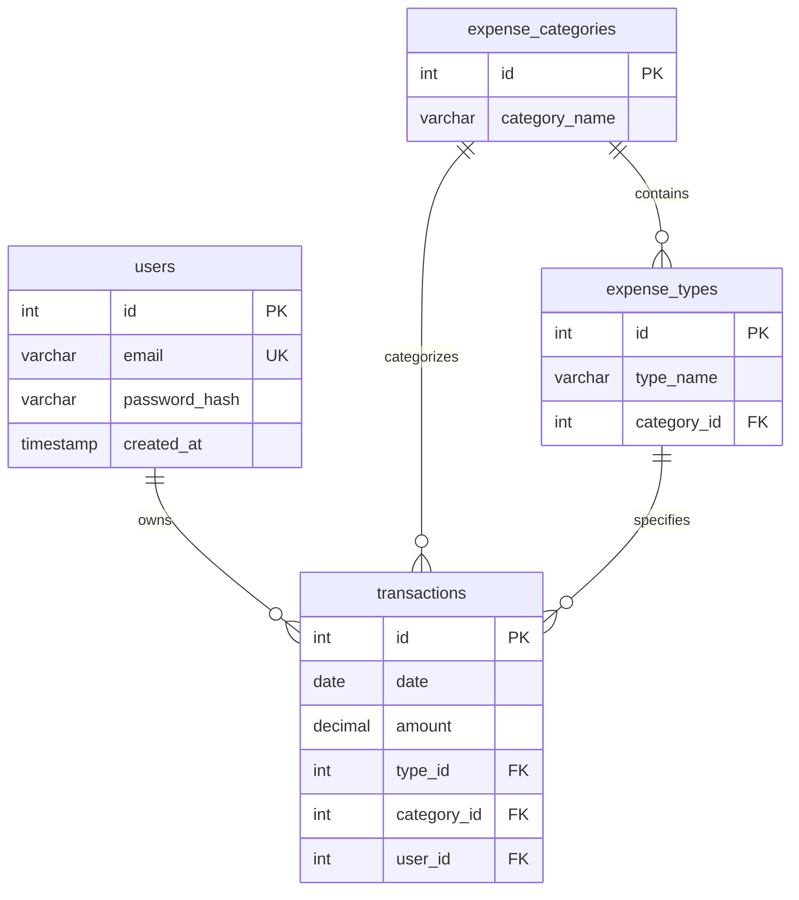
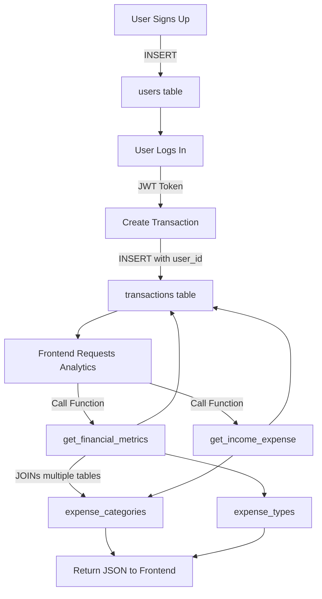

# SQL Migrations Deep Dive: Money Tracking Application

> [!NOTE]
> **Target Audience**: This guide is written for developers with basic SQL knowledge who want to fully understand database migrations, schema design, and PostgreSQL functions. We'll build from fundamentals to advanced concepts step-by-step.

---

## 📋 Table of Contents

1. [What Are Database Migrations?](#what-are-database-migrations)
2. [The Big Picture: Your Database Schema](#the-big-picture-your-database-schema)
3. [Migration 1: Creating the Main Tables](#migration-1-creating-the-main-tables)
4. [Migration 2: Seeding the Data Model](#migration-2-seeding-the-data-model)
5. [Migration 3: Adding Users Table](#migration-3-adding-users-table)
6. [PostgreSQL Functions: Advanced Analytics](#postgresql-functions-advanced-analytics)
7. [How They All Work Together](#how-they-all-work-together)
8. [Summary \u0026 Key Takeaways](#summary--key-takeaways)

---

## What Are Database Migrations?

### 🤔 Why Do We Need Migrations?

Imagine you're building a house. You don't just randomly add rooms - you follow a blueprint and build in a specific order:
1. Foundation first
2. Then walls
3. Then roof
4. Finally, interior details

**Database migrations work the same way!** They are:

- **Ordered, versioned changes** to your database structure
- **Reproducible scripts** that can be run on any environment (development, staging, production)
- **Reversible** - you can "undo" changes if something goes wrong
- **Tracked** - you know exactly what version of the database you're on

### 🔢 Understanding Migration Naming

Your migration files have timestamps in their names:
- `20240305063418723_create-main-tables.sql`
- `20240305063429859_create-data-model.sql`
- `20240717120000_add-users-table.sql`

The numbers are **timestamps**: `YYYYMMDDHHMMSS...`
- `20240305` = March 5, 2024
- `20240717` = July 17, 2024

This ensures migrations run **in chronological order**.

### ⬆️⬇️ Up \u0026 Down Migrations

Each migration has two parts:

1. **UP Migration** (`BEGIN; ... COMMIT;`) - Creates or modifies things
2. **DOWN Migration** - Undoes what the UP migration did (reverses changes)

Think of it like:
- **UP** = Drive forward
- **DOWN** = Reverse back to where you were

---

## The Big Picture: Your Database Schema

Before diving into each file, let's see the **final database structure** these migrations create:



### 🎯 Key Concepts to Understand

1. **Primary Key (PK)**: A unique identifier for each row (like a social security number)
2. **Foreign Key (FK)**: A reference to a Primary Key in another table (creates relationships)
3. **Normalization**: Organizing data to avoid duplication

**Example of why we need multiple tables:**

❌ **Bad Design (One Table)**:
```
transactions: [id, date, amount, category_name, type_name, user_email, ...]
```
*Problem*: If you have 1000 "Groceries" transactions, you repeat the word "Groceries" 1000 times!

✅ **Good Design (Normalized)**:
```
expense_categories: [id=2, category_name="Personal Fixed Costs"]
expense_types: [id=4, type_name="Groceries", category_id=2]
transactions: [id=14, amount=112, type_id=4, category_id=2, ...]
```
*Benefit*: Store "Groceries" once, just reference its ID!

---

## Migration 1: Creating the Main Tables

**File**: `20240305063418723_create-main-tables.sql`

This is the **foundation** - like building the frame of a house. It creates three essential tables.

### 📊 Table 1: expense_categories

```sql
CREATE TABLE IF NOT EXISTS expense_categories (
    id SERIAL PRIMARY KEY,
    category_name VARCHAR(255) NOT NULL
);
```

**What does each line mean?**

| Code | Explanation |
|------|-------------|
| `CREATE TABLE IF NOT EXISTS` | Create the table only if it doesn't already exist (prevents errors) |
| `expense_categories` | Table name |
| `id SERIAL PRIMARY KEY` | Auto-incrementing ID (1, 2, 3, ...) that uniquely identifies each category |
| `category_name VARCHAR(255) NOT NULL` | Text field (max 255 characters) that cannot be empty |

**Purpose**: This is the **highest level** of organization. Examples:
- "Income"
- "Personal Fixed Costs"
- "Housing Fixed Costs"

### 🏷️ Table 2: expense_types

```sql
CREATE TABLE IF NOT EXISTS expense_types (
    id SERIAL PRIMARY KEY,
    type_name VARCHAR(255) NOT NULL,
    category_id INT NOT NULL,
    FOREIGN KEY (category_id) REFERENCES expense_categories(id)
);
```

**New concept: FOREIGN KEY**

```sql
FOREIGN KEY (category_id) REFERENCES expense_categories(id)
```

This creates a **parent-child relationship**:
- Each `expense_type` **belongs to** one `expense_category`
- You can't create a type with `category_id=99` if category 99 doesn't exist
- This maintains **data integrity**

**Example Hierarchy**:
```
Category: "Personal Fixed Costs" (id=2)
  ├─ Type: "Groceries" (id=4, category_id=2)
  ├─ Type: "Gym" (id=5, category_id=2)
  └─ Type: "Mobile Phone" (id=7, category_id=2)
```

### 💰 Table 3: transactions

```sql
CREATE TABLE IF NOT EXISTS transactions (
    id SERIAL PRIMARY KEY,
    date DATE NOT NULL,
    amount DECIMAL(10, 2) NOT NULL,
    type_id INT NOT NULL,
    category_id INT NOT NULL,
    FOREIGN KEY (type_id) REFERENCES expense_types(id),
    FOREIGN KEY (category_id) REFERENCES expense_categories(id)
);
```

**Key Points**:

1. **DECIMAL(10, 2)**: Stores money values
   - `10` = total digits
   - `2` = decimal places
   - Example: `12345678.99` (8 digits + 2 decimals = 10 total)

2. **Two Foreign Keys**: Each transaction references both:
   - `type_id` → Links to a specific expense type
   - `category_id` → Directly links to category (for faster queries)

3. **Design Decision**: Why store both `type_id` AND `category_id`?
   
   ```sql
   -- You COULD get category through type alone:
   transactions → expense_types → expense_categories
   
   -- But storing category_id directly is FASTER:
   transactions → expense_categories
   ```
   
   **Comment in code says**:
   > "Including category_id in transactions for direct reference, though it could be inferred through expense_types"
   
   This is called **denormalization for performance** - sacrificing some redundancy for faster queries.

### 🔒 Transaction Safety: BEGIN \u0026 COMMIT

```sql
BEGIN;
-- ... all CREATE TABLE statements ...
COMMIT;
```

**Why?**
- `BEGIN;` starts a **transaction**
- If ANY statement fails, **ALL changes are rolled back**
- `COMMIT;` makes all changes permanent

**Analogy**: It's like a "Save Point" in a video game. If you die during a mission, you restart from the save point - you don't keep half-completed progress.

---

## Migration 2: Seeding the Data Model

**File**: `20240305063429859_create-data-model.sql`

This migration **populates** the empty tables with initial data. Think of Migration 1 as building empty shelves, and Migration 2 as stocking them.

### 📦 Seeding expense_categories

```sql
INSERT INTO expense_categories (category_name) VALUES 
('Income'),
('Personal Fixed Costs'),
('Personal Running Costs'),
('Housing Fixed Costs'),
('Travel Costs');
```

**Result**:
| id | category_name |
|----|--------------|
| 1 | Income |
| 2 | Personal Fixed Costs |
| 3 | Personal Running Costs |
| 4 | Housing Fixed Costs |
| 5 | Travel Costs |

*Note*: IDs are auto-generated by `SERIAL`, so we don't specify them.

### 🏪 Seeding expense_types

```sql
INSERT INTO expense_types (type_name, category_id) VALUES 
('Salary', 1),
('Bonus',1),
('Other Income',1),
('Groceries', 2),
('Gym', 2),
-- ... more types ...
('Rent', 4),
('Tickets', 5),
('Transportation',3);
```

**Understanding the relationships**:

```
Income (category_id=1):
  ├─ Salary (type_id=1)
  ├─ Bonus (type_id=2)
  └─ Other Income (type_id=3)

Personal Fixed Costs (category_id=2):
  ├─ Groceries (type_id=4)
  ├─ Gym (type_id=5)
  ├─ Akasse (type_id=6)
  └─ ... more ...

Personal Running Costs (category_id=3):
  ├─ Shopping Clothes (type_id=9)
  ├─ Restaurants (type_id=13)
  └─ Transportation (type_id=21)
```

### 🧪 Test Data: Sample Transactions

```sql
INSERT INTO transactions (id, date, amount, type_id, category_id)
VALUES
    (7, '2024-01-02', 222.00, 14, 3),
    (8, '2024-01-02', 26740.00, 1, 1),  -- Salary!
    (9, '2024-01-07', 152.00, 4, 2),
    -- ... 60+ more rows ...
```

**Why include test data?**
- **Development**: Easier to test UI with real-looking data
- **Demonstrations**: Show stakeholders how the app works
- **Testing**: Verify analytics functions return correct results

**Example Transaction Breakdown**:
```sql
(7, '2024-01-02', 222.00, 14, 3)
```
- `id=7`: Transaction #7
- `date='2024-01-02'`: January 2, 2024
- `amount=222.00`: 222 currency units
- `type_id=14`: Looking at the types, this is "Shopping Clothes"
- `category_id=3`: "Personal Running Costs"

---

## Migration 3: Adding Users Table

**File**: `20240717120000_add-users-table.sql`

This migration was created **4+ months later** (March → July). Why?

**Likely scenario**: 
1. Original app was single-user (just for you)
2. Later decided to add **multi-user support** (authentication)
3. Created new migration to add users without destroying existing data

### 👤 Creating the users Table

```sql
CREATE TABLE IF NOT EXISTS users (
    id SERIAL PRIMARY KEY,
    email VARCHAR(255) NOT NULL UNIQUE,
    password_hash VARCHAR(255) NOT NULL,
    created_at TIMESTAMP WITH TIME ZONE DEFAULT CURRENT_TIMESTAMP
);
```

**New concepts**:

1. **UNIQUE Constraint**:
   ```sql
   email VARCHAR(255) NOT NULL UNIQUE
   ```
   - Each email can appear only ONCE
   - Prevents duplicate user accounts
   - Database will reject `INSERT` if email already exists

2. **Password Hashing**:
   ```sql
   password_hash VARCHAR(255) NOT NULL
   ```
   - Never store plain passwords! (`password='qwerty123'` ❌)
   - Store hashed versions: (`password_hash='$2a$10$N9qo8...'` ✅)
   - Even if database is stolen, passwords are protected

3. **Timestamp with Timezone**:
   ```sql
   created_at TIMESTAMP WITH TIME ZONE DEFAULT CURRENT_TIMESTAMP
   ```
   - **TIMESTAMP WITH TIME ZONE**: Stores exact moment in time with timezone info
   - **DEFAULT CURRENT_TIMESTAMP**: Automatically sets to "now" when row is created
   - You don't need to provide this value - it's automatic!

### 🔗 Linking Transactions to Users

```sql
ALTER TABLE transactions
ADD COLUMN user_id INTEGER,
ADD CONSTRAINT fk_user
    FOREIGN KEY(user_id) 
    REFERENCES users(id)
    ON DELETE CASCADE;
```

**Breaking this down**:

1. **ALTER TABLE**: Modifies an existing table (doesn't recreate it)

2. **ADD COLUMN user_id INTEGER**: Adds a new column to store which user owns each transaction

3. **ADD CONSTRAINT fk_user**: Creates a named foreign key relationship
   - **Why name it?** So you can drop it later in DOWN migration

4. **ON DELETE CASCADE**: Critical concept!
   ```
   If a user is deleted → automatically delete ALL their transactions
   ```
   
   **Example**:
   ```sql
   User id=5 exists
   Transactions: [100, 101, 102] all have user_id=5
   
   DELETE FROM users WHERE id=5;
   
   Result: User 5 AND transactions 100, 101, 102 are ALL deleted automatically
   ```
   
   **Alternative behaviors**:
   - `ON DELETE SET NULL`: Set user_id to NULL (orphan transactions)
   - `ON DELETE RESTRICT`: Prevent user deletion if they have transactions
   - `ON DELETE CASCADE`: Delete everything (chosen here)

### ↩️ Down Migration

```sql
BEGIN;
ALTER TABLE transactions
DROP CONSTRAINT fk_user,
DROP COLUMN user_id;
DROP TABLE IF EXISTS users;
COMMIT;
```

**Order matters!**
1. First: Remove foreign key constraint (`fk_user`)
2. Second: Remove the column (`user_id`)
3. Third: Drop the entire users table

**Why this order?** You can't drop a table that other tables still reference!

---

## PostgreSQL Functions: Advanced Analytics

These aren't migrations - they're **stored procedures** (reusable SQL functions). Think of them as "saved complex queries" you can call from your application.

### 📊 Function 1: get_financial_metrics

**File**: `get_financial_overview.sql`

**Purpose**: Calculate comprehensive financial analytics for a user.

#### What Does It Return?

```sql
RETURNS TABLE(
    report_year TEXT,
    total_income_value DECIMAL,
    expense_category VARCHAR,
    total_expense_value DECIMAL,
    total_yearly_expenses DECIMAL,
    net_income_value DECIMAL,
    cumulative_net_income_value DECIMAL,
    savings_rate_value DECIMAL
)
```

**Example output**:

| report_year | total_income_value | expense_category | total_expense_value | net_income_value | savings_rate_value |
|-------------|-------------------|------------------|---------------------|------------------|-------------------|
| 2025 | 320,880 | Housing Fixed Costs | 15.2% | 235,000 | 73.2% |
| 2025 | 320,880 | Travel Costs | 8.5% | 235,000 | 73.2% |
| ... | ... | ... | ... | ... | ... |

#### Breaking Down the Function

**1. Input Parameter**:
```sql
CREATE OR REPLACE FUNCTION get_financial_metrics(p_user_id INT)
```
- `p_user_id`: Only calculate metrics for this specific user
- Prefix `p_` is a naming convention for "parameter"

**2. CTEs (Common Table Expressions)**: The function uses **WITH clauses** to break complex logic into steps

```sql
WITH category_totals AS (...),
     income_total AS (...),
     expense_total AS (...),
     ...
```

Think of CTEs as **temporary named result sets** - like variables for queries.

**Step-by-Step Logic**:

**CTE 1: category_totals** - Group all transactions by category and year
```sql
SELECT 
    ec.category_name,
    TO_CHAR(t.date, 'YYYY') AS year,  -- Extract year as text
    SUM(t.amount) AS total_amount,
    CASE 
        WHEN ec.category_name = 'Income' THEN 'Income'
        ELSE 'Expense'
    END AS type
FROM transactions t
JOIN expense_categories ec ON t.category_id = ec.id
WHERE t.user_id = p_user_id
GROUP BY ec.category_name, TO_CHAR(t.date, 'YYYY')
```

**Result might look like**:
| category_name | year | total_amount | type |
|--------------|------|--------------|------|
| Income | 2025 | 320,880 | Income |
| Housing Fixed Costs | 2025 | 86,448 | Expense |
| Travel Costs | 2025 | 15,230 | Expense |

**CTE 2: income_total** - Sum all income per year
```sql
SELECT 
    year,
    SUM(total_amount) AS total_income
FROM category_totals
WHERE type = 'Income'
GROUP BY year
```

**CTE 3: expense_total** - Keep expenses broken down by category
```sql
SELECT 
    year,
    category_name,
    SUM(total_amount) AS total_expense
FROM category_totals
WHERE type = 'Expense'
GROUP BY year, category_name
```

**CTE 4: yearly_expenses** - Total ALL expenses per year
```sql
SELECT
    year,
    SUM(total_expense) AS total_yearly_expenses
FROM expense_total
GROUP BY year
```

**CTE 5: net_income** - Income minus expenses
```sql
SELECT 
    i.year,
    (i.total_income - COALESCE(m.total_yearly_expenses, 0)) AS total_net_income
FROM income_total i
JOIN yearly_expenses m ON i.year = m.year
```

**COALESCE explained**:
```sql
COALESCE(m.total_yearly_expenses, 0)
```
- Returns first non-NULL value
- If `total_yearly_expenses` is NULL, use `0`
- Prevents NULL arithmetic errors

**CTE 6: cumulative_net_income** - Running total using **window function**
```sql
SELECT 
    year,
    SUM(total_net_income) OVER (ORDER BY year) AS cumulative_income
FROM net_income
```

**Window function magic**:
```
Year | net_income | cumulative_income
-----|------------|------------------
2023 | 100,000    | 100,000         (just 2023)
2024 | 150,000    | 250,000         (2023+2024)
2025 | 235,000    | 485,000         (2023+2024+2025)
```

The `OVER (ORDER BY year)` creates a "running total" - each row sees all previous rows.

**Final SELECT**: Combines everything
```sql
SELECT 
    i.year AS report_year,
    i.total_income AS total_income_value,
    e.category_name AS expense_category,
    (e.total_expense / NULLIF(i.total_income, 0)) * 100 AS total_expense_value,
    (m.total_yearly_expenses / NULLIF(i.total_income, 0)) * 100 AS total_yearly_expenses,
    n.total_net_income  AS net_income_value,
    c.cumulative_income AS cumulative_net_income_value, 
    (n.total_net_income / NULLIF(i.total_income, 0)) * 100 AS savings_rate_value
FROM income_total i
JOIN expense_total e ON i.year = e.year
JOIN yearly_expenses m ON i.year = m.year
JOIN net_income n ON i.year = n.year
JOIN cumulative_net_income c ON i.year = c.year
ORDER BY i.year, e.category_name;
```

**NULLIF explained**:
```sql
e.total_expense / NULLIF(i.total_income, 0)
```
- **Problem**: Division by zero crashes
- **Solution**: `NULLIF(i.total_income, 0)` returns NULL if income is 0
- Result: `100 / NULL = NULL` (doesn't crash)

---

### 💸 Function 2: get_income_expense

**File**: `get_income_expense.sql`

**Purpose**: Get monthly income vs expense comparison for charting cashflow.

#### What Does It Return?

```sql
RETURNS TABLE(
    dates TEXT,      -- '2025-01' format
    category TEXT,   -- 'Income', 'Expense', or 'Savings'
    amount TEXT      -- Amount as text
)
```

**Example output** (ready for a chart):

| dates | category | amount |
|-------|----------|--------|
| 2025-01 | Income | 26740 |
| 2025-01 | Expense | 12350 |
| 2025-01 | Savings | 53.81 |
| 2025-02 | Income | 26740 |
| 2025-02 | Expense | 8920 |
| 2025-02 | Savings | 66.64 |

**Step-by-Step**:

**CTE 1: cat** - Simplify categories to just "Income" vs "Expense"
```sql
SELECT 
    id,
    CASE 
        WHEN category_name <> 'Income' THEN 'Expense'
        ELSE 'Income'
    END AS names
FROM expense_categories
```

**Result**:
```
id=1: Income
id=2: Expense
id=3: Expense
id=4: Expense
id=5: Expense
```

**CTE 2: monthly_totals** - Sum by month
```sql
SELECT 
    SUM(t.amount) AS total, 
    TO_CHAR(t.date, 'YYYY-MM') AS time,  -- '2025-01'
    ec.names 
FROM transactions t 
JOIN cat ec ON ec.id = t.category_id 
WHERE t.user_id = p_user_id
GROUP BY 2, 3  -- GROUP BY time, names
```

**CTE 3: monthly_income_expense** - Pivot the data
```sql
SELECT 
    time,
    MAX(CASE WHEN names = 'Income' THEN total ELSE 0 END) AS income,
    MAX(CASE WHEN names = 'Expense' THEN total ELSE 0 END) AS expense
FROM monthly_totals
GROUP BY time
```

**What's happening?** This transforms:
```
time     | names   | total
---------|---------|-------
2025-01  | Income  | 26740
2025-01  | Expense | 12350
```

Into:
```
time     | income | expense
---------|--------|--------
2025-01  | 26740  | 12350
```

This is called **pivoting** - turning rows into columns!

**Final UNION**: Return three rows per month
```sql
SELECT time, 'Income', income::text    -- Row 1
UNION ALL
SELECT time, 'Expense', expense::text  -- Row 2
UNION ALL
SELECT time, 'Savings',                -- Row 3
       ROUND( ( (income - expense)/income ) * 100, 2)::text
```

**UNION ALL** stacks queries vertically:
```
Query 1 results
Query 2 results  ← UNION ALL stacks them
Query 3 results
```

**::text** is casting (type conversion):
```sql
income::text  -- Convert number to text
```

**Savings calculation**:
```sql
ROUND( ( (income - expense)/income ) * 100, 2)
```
- `(income - expense)` = net savings amount
- `/income` = what percentage of income
- `* 100` = convert 0.6664 to 66.64
- `ROUND(..., 2)` = round to 2 decimals

---

## How They All Work Together

### 🔄 Execution Order

```
1. Migration 1 (create-main-tables.sql)
   ↓ Creates structure
   
2. Migration 2 (create-data-model.sql)
   ↓ Populates data
   
3. Migration 3 (add-users-table.sql)
   ↓ Adds authentication
   
4. PostgreSQL Functions
   ← Called by your application to fetch analytics
```

### 🏗️ Data Flow Diagram



### 🎬 Real-World Scenario

**1. Setup Phase** (Runs once per environment):
```bash
npm run migrate:up
```
- Creates all tables
- Seeds categories and types
- Adds sample transactions

**2. User Registration** (First-time user):
```sql
INSERT INTO users (email, password_hash)
VALUES ('john@example.com', '$2a$10$...');
-- New user: id=1
```

**3. User Creates Transaction**:
```sql
INSERT INTO transactions (date, amount, type_id, category_id, user_id)
VALUES ('2025-11-19', 45.50, 4, 2, 1);
-- Purchased groceries
```

**4. Frontend Requests Dashboard Data**:
```javascript
// JavaScript in your frontend
const response = await fetch('/api/financial-overview?userId=1');
```

**5. Backend Executes Function**:
```sql
SELECT * FROM get_financial_metrics(1);
```

**6. Function Returns Data**:
```json
{
  "report_year": "2025",
  "total_income_value": 320880,
  "expense_category": "Personal Fixed Costs",
  "total_expense_value": 12.5,
  "savings_rate_value": 73.2
}
```

**7. Frontend Renders Chart** 📊

---

## Summary \u0026 Key Takeaways

### ✅ What You've Learned

#### Database Design Concepts
- **Normalization**: Avoid data duplication by splitting into related tables
- **Primary Keys**: Unique identifiers (`SERIAL PRIMARY KEY`)
- **Foreign Keys**: Create relationships between tables
- **Constraints**: Enforce data integrity (`NOT NULL`, `UNIQUE`)
- **Cascading Deletes**: Automatically clean up related data

#### Migration Concepts
- **Ordered Changes**: Timestamp-based naming ensures correct sequence
- **Transactions**: `BEGIN/COMMIT` for atomic changes
- **Reversibility**: Up and Down migrations for safety
- **Versioning**: Track what version of schema you're running

#### SQL Advanced Features
- **CTEs (WITH clauses)**: Break complex queries into readable steps
- **Window Functions**: Calculate running totals and rankings
- **CASE Statements**: Conditional logic in queries
- **Aggregate Functions**: `SUM()`, `COUNT()`, `AVG()`, etc.
- **JOINs**: Combine data from multiple tables
- **Type Casting**: `::text`, `::int` for conversions

#### PostgreSQL-Specific Features
- **Stored Functions**: Reusable server-side logic
- **TIMESTAMP WITH TIME ZONE**: Timezone-aware dates
- **NULLIF/COALESCE**: Handle NULL values gracefully
- **TO_CHAR**: Format dates as text

### 📚 The Complete Data Model

```
users (authentication)
  ↓ user_id
transactions (financial records)
  ↓ category_id + type_id
expense_categories (top-level)
  ↓ category_id
expense_types (subcategories)
```

### 🎯 Why This Architecture?

1. **Scalability**: Add millions of transactions without duplicating category names
2. **Data Integrity**: Foreign keys prevent orphaned or invalid data
3. **Multi-tenancy**: Each user's data is isolated via `user_id`
4. **Performance**: Direct `category_id` reference speeds up queries
5. **Flexibility**: Easy to add new categories/types without changing code
6. **Analytics**: Complex calculations done efficiently in the database

### 🔮 Next Steps

Now that you understand the database layer, you can:

1. **Explore Backend Code**: See how Node.js calls these functions
2. **Study Frontend**: Understand how React displays the data
3. **Add Features**: Create new migrations for additional tables
4. **Optimize**: Add indexes for commonly queried columns
5. **Security**: Implement row-level security policies

---

> [!TIP]
> **Practice Exercise**: Try writing a new migration that adds a `notes` column to the transactions table, then write the corresponding UP and DOWN migration. This will solidify your understanding!

