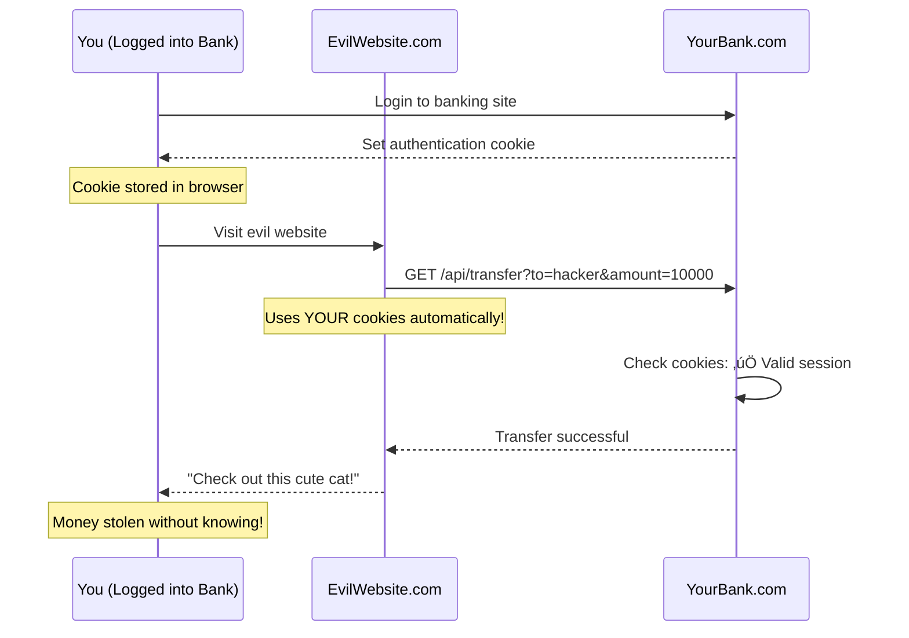

JamesSoh2000: What is CORS in this context? Give me detailed explanation for me to fully understand. Be specific as possible.

GitHub Copilot: # CORS (Cross-Origin Resource Sharing) - Deep Dive Explanation

## 🎯 What Problem Does CORS Solve?

### The Real-World Scenario

Imagine you're building your Personal Finance Tracker:

- **Frontend (React)** runs at: `http://localhost:3001`
- **Backend (Express)** runs at: `http://localhost:8000`

When your React app tries to fetch data from your Express server, you're making a **cross-origin request** (different port = different origin). **Without CORS, browsers block this by default for security reasons.**

---

## üîí Why Browsers Block Cross-Origin Requests (The Security Problem)

### The Malicious Website Attack (Why CORS Exists)

**Scenario WITHOUT CORS protection:**



**What happened?**

1. You logged into `YourBank.com` ‚Üí Browser stores authentication cookie
2. You visit `EvilWebsite.com` (accidentally clicked a link)
3. Evil site's JavaScript makes a request to `YourBank.com/api/transfer`
4. **Browser automatically includes your bank cookies** (this is how cookies work!)
5. Bank sees valid cookie, processes transfer ‚Üí **You're hacked!**

### The Same-Origin Policy (Browser's Defense)

To prevent this, browsers enforce the **Same-Origin Policy**:

> **"A website can only make JavaScript requests to its own origin (same protocol + domain + port)"**

**What counts as "same origin"?**

| URL 1 | URL 2 | Same Origin? | Why? |
|-------|-------|--------------|------|
| `http://localhost:3001` | `http://localhost:8000` | ❌ NO | Different ports (3001 ≠ 8000) |
| `http://localhost:3001` | `https://localhost:3001` | ❌ NO | Different protocols (http ≠ https) |
| `http://example.com` | `http://api.example.com` | ‚ùå NO | Different subdomains |
| `http://localhost:3001/page1` | `http://localhost:3001/page2` | ‚úÖ YES | Same protocol, domain, port |

**In your case:**

```javascript
// Running in React app at http://localhost:3001
fetch('http://localhost:8000/feed/transactions')
//                          ^^^^^ Different port!
// ‚ùå BLOCKED by Same-Origin Policy
```

---

## üåâ How CORS Solves This (Controlled Access)

CORS allows servers to say: **"I trust certain other origins to make requests to me."**

### The CORS Handshake (Detailed Explanation)

#### **Step 1: Browser Sends Preflight Request (OPTIONS)**

Before the actual request, browsers send a "preflight" OPTIONS request to ask permission:

```http
OPTIONS /auth/login HTTP/1.1
Host: localhost:8000
Origin: http://localhost:3001
Access-Control-Request-Method: POST
Access-Control-Request-Headers: Content-Type
```

**What the browser is asking:**
- "I'm from `http://localhost:3001`"
- "I want to make a POST request"
- "I want to send JSON data (Content-Type header)"
- **"Is this allowed?"**

#### **Step 2: Server Responds with CORS Headers**

Your Express server (with `app.use(cors())`) responds:

```http
HTTP/1.1 204 No Content
Access-Control-Allow-Origin: *
Access-Control-Allow-Methods: GET,HEAD,PUT,PATCH,POST,DELETE
Access-Control-Allow-Headers: Content-Type
Access-Control-Max-Age: 86400
```

**What the server is saying:**
- `Access-Control-Allow-Origin: *` ‚Üí **"Any origin is allowed"**
- `Access-Control-Allow-Methods: POST` ‚Üí **"POST requests are OK"**
- `Access-Control-Allow-Headers: Content-Type` ‚Üí **"You can send JSON"**
- `Access-Control-Max-Age: 86400` ‚Üí **"Cache this permission for 24 hours"**

#### **Step 3: Browser Sends Actual Request**

If the preflight succeeds, the browser sends the real request:

```http
POST /auth/login HTTP/1.1
Host: localhost:8000
Origin: http://localhost:3001
Content-Type: application/json

{"email": "alice@example.com", "password": "secret123"}
```

#### **Step 4: Server Processes and Responds**

```http
HTTP/1.1 200 OK
Access-Control-Allow-Origin: *
Content-Type: application/json

{"token": "eyJhbGciOiJIUzI1NiIsInR5cCI6IkpXVCJ9..."}
```

**Key point:** The `Access-Control-Allow-Origin` header **must be present in EVERY response**, not just the preflight.

---

## üîß Your CORS Configuration Explained

### The Code in `tracker.ts`:

```typescript
app.use(cors({
    origin: "*",  
    methods: "GET,HEAD,PUT,PATCH,POST,DELETE",
    preflightContinue: false,
    optionsSuccessStatus: 204
}));
```

### Line-by-Line Breakdown:

#### **1. `origin: "*"`**

**Meaning:** Allow requests from **ANY origin** (wildcard)

**What it does:**
```http
Access-Control-Allow-Origin: *
```

**Alternatives:**

```typescript
// ‚úÖ PRODUCTION: Only allow your deployed frontend
origin: "https://myfinancetracker.com"

// ‚úÖ DEVELOPMENT: Allow localhost on different ports
origin: ["http://localhost:3000", "http://localhost:3001"]

// ‚úÖ DYNAMIC: Allow any subdomain
origin: /\.myfinancetracker\.com$/

// ‚úÖ FUNCTION: Custom logic
origin: (origin, callback) => {
  const allowedOrigins = ['http://localhost:3001', 'https://myapp.com'];
  if (!origin || allowedOrigins.includes(origin)) {
    callback(null, true);  // Allow
  } else {
    callback(new Error('Not allowed by CORS'));
  }
}
```

**⚠️ Security Warning:**

```typescript
origin: "*"  // ‚ùå DON'T USE IN PRODUCTION!
// Why? ANY website can make requests to your API
// If you're using cookies/credentials, this won't even work (browsers block it)
```

#### **2. `methods: "GET,HEAD,PUT,PATCH,POST,DELETE"`**

**Meaning:** These HTTP methods are allowed for cross-origin requests

**What it does:**
```http
Access-Control-Allow-Methods: GET,HEAD,PUT,PATCH,POST,DELETE
```

**Real-world examples:**

```javascript
// ‚úÖ Allowed (GET is in the list)
fetch('http://localhost:8000/feed/transactions')

// ‚úÖ Allowed (POST is in the list)
fetch('http://localhost:8000/auth/login', { method: 'POST', ... })

// ‚ùå Blocked (TRACE not in the list)
fetch('http://localhost:8000/feed/transactions', { method: 'TRACE' })
```

#### **3. `preflightContinue: false`**

**Meaning:** Don't pass preflight requests to route handlers

**What it does:**

```typescript
// With preflightContinue: false (your setting)
app.options('/auth/login', (req, res) => {
  // This NEVER runs - CORS middleware handles OPTIONS automatically
});

// With preflightContinue: true
app.options('/auth/login', (req, res) => {
  // This WOULD run - you'd need to manually handle CORS headers
  res.header('Access-Control-Allow-Origin', '*');
  res.send();
});
```

**Why `false` is correct:** Let the CORS middleware handle it automatically.

#### **4. `optionsSuccessStatus: 204`**

**Meaning:** Respond to preflight requests with status code 204 (No Content)

**Why 204?**

- `204 No Content` = "Request successful, but no response body"
- Preflight responses don't need a body (just headers)
- Some old browsers (IE11) don't like `200 OK` with empty body

**What it does:**

```http
HTTP/1.1 204 No Content  ‚Üê Status code
Access-Control-Allow-Origin: *
Access-Control-Allow-Methods: GET,POST,...
```

---

## üîç Common CORS Errors & Fixes

### **Error 1: "Access-Control-Allow-Origin missing"**

**Browser Console:**
```
Access to fetch at 'http://localhost:8000/auth/login' from origin 
'http://localhost:3001' has been blocked by CORS policy: 
No 'Access-Control-Allow-Origin' header is present on the requested resource.
```

**Cause:** CORS middleware not installed or not configured

**Fix:**
```typescript
// ‚úÖ Add BEFORE route registration
app.use(cors());
app.use('/auth', authRoutes);  // Routes come AFTER
```

---

### **Error 2: "Origin not allowed by Access-Control-Allow-Origin"**

**Browser Console:**
```
The 'Access-Control-Allow-Origin' header has a value 'http://localhost:3000' 
that is not equal to the supplied origin 'http://localhost:3001'.
```

**Cause:** Your frontend origin isn't in the allowed list

**Fix:**
```typescript
// ‚ùå Wrong origin
app.use(cors({ origin: "http://localhost:3000" }));

// ‚úÖ Match your React app's port
app.use(cors({ origin: "http://localhost:3001" }));

// ‚úÖ Or allow multiple
app.use(cors({ 
  origin: ["http://localhost:3000", "http://localhost:3001"] 
}));
```

---

### **Error 3: "Preflight response is not successful"**

**Browser Console:**
```
Response for preflight has invalid HTTP status code 404
```

**Cause:** Your server doesn't respond to OPTIONS requests

**Fix:**
```typescript
// ‚úÖ Make sure CORS middleware is registered
app.use(cors());  // This handles OPTIONS automatically
```

---

### **Error 4: "Credentials mode but Access-Control-Allow-Origin is *"**

**Browser Console:**
```
The value of the 'Access-Control-Allow-Origin' header in the response 
must not be the wildcard '*' when the request's credentials mode is 'include'.
```

**Cause:** You're sending cookies but using `origin: "*"`

**Fix:**
```typescript
// ‚ùå Won't work with credentials
app.use(cors({ origin: "*" }));

fetch('http://localhost:8000/api', { credentials: 'include' });

// ‚úÖ Specify exact origin
app.use(cors({ 
  origin: "http://localhost:3001",
  credentials: true  // Allow cookies
}));

fetch('http://localhost:8000/api', { credentials: 'include' });
```

---

## üß™ Testing CORS (Practical Examples)

### **Test 1: Verify CORS is Working**

```javascript
// In your React app (http://localhost:3001)
fetch('http://localhost:8000/feed/transactions')
  .then(res => res.json())
  .then(data => console.log('‚úÖ CORS working!', data))
  .catch(err => console.error('‚ùå CORS blocked:', err));
```

**If CORS is working:** You see data in console
**If CORS is broken:** Browser console shows red error

---

### **Test 2: See CORS Headers in Browser**

1. Open browser DevTools ‚Üí **Network** tab
2. Make a request from React app
3. Click the request ‚Üí **Headers** tab
4. Look for:

```http
Response Headers:
  Access-Control-Allow-Origin: *
  Access-Control-Allow-Methods: GET,POST,...
```

---

### **Test 3: Manually Test with cURL**

```bash
# Send preflight request
curl -X OPTIONS http://localhost:8000/auth/login \
  -H "Origin: http://localhost:3001" \
  -H "Access-Control-Request-Method: POST" \
  -v

# Expected output includes:
# Access-Control-Allow-Origin: *
# Access-Control-Allow-Methods: GET,HEAD,PUT,PATCH,POST,DELETE
```

---

## 🎯 When Do You Need CORS?

| Scenario | CORS Needed? | Why? |
|----------|-------------|------|
| React (localhost:3001) ‚Üí Express (localhost:8000) | ‚úÖ YES | Different ports = different origins |
| React (myapp.com) ‚Üí Express (api.myapp.com) | ‚úÖ YES | Different subdomains |
| React + Express served from same origin | ‚ùå NO | Same protocol + domain + port |
| Mobile app ‚Üí Express server | ‚ùå NO | CORS only applies to web browsers |
| Server-to-server API calls | ‚ùå NO | CORS is a browser security feature |

---

## üîí Production Best Practices

```typescript
// ‚ùå NEVER in production
app.use(cors({ origin: "*" }));

// ‚úÖ PRODUCTION setup
app.use(cors({
  origin: process.env.FRONTEND_URL,  // "https://myfinancetracker.com"
  methods: ["GET", "POST", "PUT", "DELETE"],
  credentials: true,  // If using cookies
  maxAge: 86400  // Cache preflight for 24 hours
}));
```

---

## ‚úÖ Summary (TL;DR)

**CORS in 3 sentences:**

1. Browsers block JavaScript requests between different origins (security feature)
2. CORS lets servers explicitly allow certain origins to make requests
3. The `cors()` middleware adds the necessary headers to your Express responses

**Your configuration (`app.use(cors({ origin: "*" }))`):**
- Allows ANY website to make requests to your backend
- Perfect for development
- **Must be restricted in production**