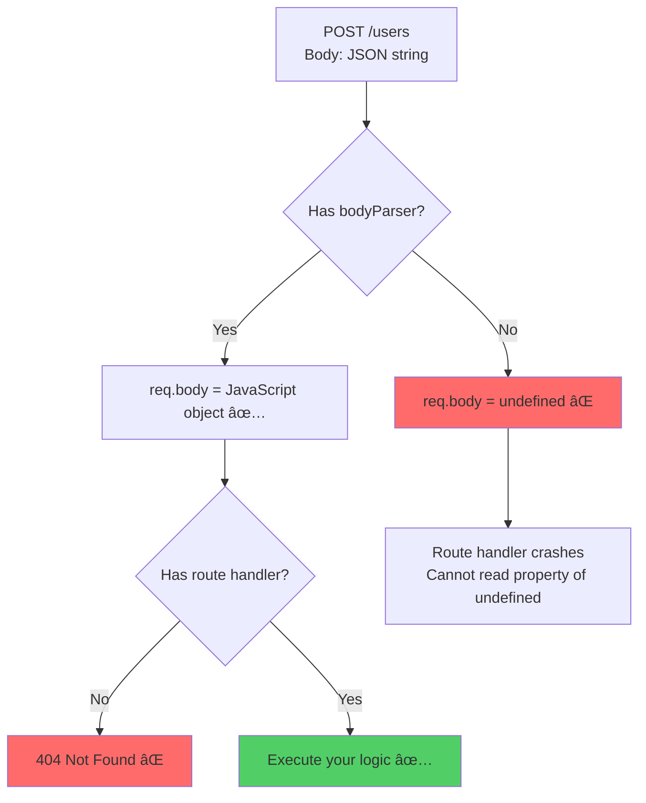

JamesSoh2000: How do you know which method is used? Give me detailed explanation how it's used with examples to fully understand.

GitHub Copilot: # Understanding How Middleware Applies to HTTP Methods

Great question! Let me clarify how `app.use()` works with different HTTP methods and how Express determines which middleware runs.

## The Key Insight

`app.use(bodyParser.json())` runs for **ALL HTTP methods** (GET, POST, PUT, DELETE, PATCH, etc.) because `app.use()` is **method-agnostic** — it doesn't care about the HTTP verb.

## How Express Processes Requests


### Example Flow Analysis

````typescript
import express from 'express';
import bodyParser from 'body-parser';

const app = express();

// Middleware 1: Runs for ALL methods, ALL paths
app.use(bodyParser.json());

// Middleware 2: Runs for ALL methods, paths starting with /api
app.use('/api', (req, res, next) => {
  console.log(`Method: ${req.method}, Path: ${req.path}`);
  next();
});

// Route 1: Runs ONLY for GET /users
app.get('/users', (req, res) => {
  res.json({ users: [] });
});

// Route 2: Runs ONLY for POST /users
app.post('/users', (req, res) => {
  // bodyParser already ran, so req.body is available
  console.log(req.body); // { name: "Alice", email: "alice@example.com" }
  res.status(201).json({ created: true });
});

// Route 3: Runs ONLY for GET /api/products
app.get('/api/products', (req, res) => {
  res.json({ products: [] });
});
````

## Request Examples

### Example 1: GET Request to /users

```http
GET http://localhost:8000/users
```

**Execution Flow:**
1. ✅ `app.use(bodyParser.json())` runs (matches all paths)
   - No body to parse (GET requests typically don't have bodies)
   - Sets `req.body = {}`
2. ⌠`app.use('/api', ...)` skipped (path doesn't start with /api)
3. ✅ `app.get('/users', ...)` runs (exact match!)
4. Response: `{ users: [] }`

---

### Example 2: POST Request to /users

```http
POST http://localhost:8000/users
Content-Type: application/json

{
  "name": "Alice",
  "email": "alice@example.com"
}
```

**Execution Flow:**
1. ✅ `app.use(bodyParser.json())` runs
   - Parses JSON body
   - Sets `req.body = { name: "Alice", email: "alice@example.com" }`
2. ⌠`app.use('/api', ...)` skipped (path doesn't start with /api)
3. ✅ `app.post('/users', ...)` runs (exact match!)
4. Console logs: `{ name: "Alice", email: "alice@example.com" }`
5. Response: `{ created: true }`

---

### Example 3: GET Request to /api/products

```http
GET http://localhost:8000/api/products
```

**Execution Flow:**
1. ✅ `app.use(bodyParser.json())` runs
   - No body to parse
   - Sets `req.body = {}`
2. ✅ `app.use('/api', ...)` runs (path starts with /api!)
   - Console logs: `Method: GET, Path: /products`
3. ✅ `app.get('/api/products', ...)` runs
4. Response: `{ products: [] }`

---

### Example 4: DELETE Request to /users/5

```http
DELETE http://localhost:8000/users/5
```

**Execution Flow:**
1. ✅ `app.use(bodyParser.json())` runs (all methods!)
2. ⌠`app.use('/api', ...)` skipped
3. ⌠No matching route handler
4. Express sends: `404 Not Found`

## Method-Specific Middleware

If you want middleware to run **only for specific HTTP methods**, use the method-specific functions:

````typescript
import express from 'express';

const app = express();

// ✅ Runs ONLY for POST requests
app.use((req, res, next) => {
  if (req.method === 'POST') {
    console.log('POST request detected!');
  }
  next();
});

// Better approach: Use express.json() conditionally
app.post('*', express.json()); // Only parse JSON for POST requests

// Or attach middleware to specific routes
const parseJson = express.json();

app.get('/users', (req, res) => {
  // No JSON parsing needed for GET
  res.json({ users: [] });
});

app.post('/users', parseJson, (req, res) => {
  // parseJson middleware runs ONLY for this POST route
  console.log(req.body);
  res.status(201).json({ created: true });
});
````

## Common Patterns

### Pattern 1: Global Middleware (All Methods, All Paths)

````typescript
// Runs for EVERY request
app.use(bodyParser.json());        // Parse JSON
app.use(cors());                   // Enable CORS
app.use(express.static('public')); // Serve static files
````

### Pattern 2: Path-Specific Middleware (All Methods, Specific Path)

````typescript
// Runs for ALL methods under /api
app.use('/api', apiLogger);
app.use('/admin', authMiddleware);
````

### Pattern 3: Route-Specific Middleware (Specific Method + Path)

````typescript
// Runs ONLY for POST /users
app.post('/users', validateUser, createUser);

// Runs ONLY for GET /users/:id
app.get('/users/:id', checkAuth, getUser);
````

## Why bodyParser Runs for All Methods

````typescript
app.use(bodyParser.json());
````

**Reason 1: Consistency**
- PUT, PATCH, DELETE can also have request bodies
- You don't want to duplicate middleware for each method

**Reason 2: Efficiency**
- bodyParser checks `Content-Type` header
- If not `application/json`, it does nothing (no performance cost)

**Reason 3: Simplicity**
- One line of code handles all cases

### What bodyParser Actually Does

````typescript
// Pseudocode for bodyParser.json()
function bodyParserJson(req, res, next) {
  if (req.headers['content-type'] === 'application/json') {
    // Read raw body stream
    let rawBody = '';
    req.on('data', chunk => rawBody += chunk);
    req.on('end', () => {
      req.body = JSON.parse(rawBody); // Parse JSON
      next(); // Continue to next middleware
    });
  } else {
    req.body = {}; // No JSON body
    next();
  }
}
````

## Practical Debugging

Want to see exactly when middleware runs? Add logging:

````typescript
app.use((req, res, next) => {
  console.log(`🔵 Global Middleware: ${req.method} ${req.path}`);
  next();
});

app.use(bodyParser.json());

app.use('/api', (req, res, next) => {
  console.log(`🟢 API Middleware: ${req.method} ${req.path}`);
  next();
});

app.get('/users', (req, res) => {
  console.log(`🟡 Route Handler: GET /users`);
  res.json({ users: [] });
});

app.post('/api/products', (req, res) => {
  console.log(`🟡 Route Handler: POST /api/products`);
  res.json({ created: true });
});
````

**Test with:**
```bash
curl http://localhost:8000/users
# Output:
# 🔵 Global Middleware: GET /users
# 🟡 Route Handler: GET /users

curl -X POST http://localhost:8000/api/products -H "Content-Type: application/json" -d '{"name":"Laptop"}'
# Output:
# 🔵 Global Middleware: POST /api/products
# 🟢 API Middleware: POST /api/products
# 🟡 Route Handler: POST /api/products
```

## Key Takeaways

1. **`app.use()` = method-agnostic** (runs for GET, POST, PUT, DELETE, etc.)
2. **`app.get()`, `app.post()`, etc. = method-specific** (runs only for that HTTP verb)
3. **Middleware runs 

JamesSoh2000: For example 2, why do you need app.post('/users') if you are going to parses JSON body using app.use(bodyParser.json())? Give me detailed explanation.

GitHub Copilot: # Why You Need BOTH `app.use(bodyParser.json())` AND `app.post('/users')`

Great question! This is a common source of confusion for beginners. Let me break down why **both are necessary** and what each one does.

---

## 🎯 The Short Answer

- **`app.use(bodyParser.json())`** = Prepares the data (parses JSON into JavaScript object)
- **`app.post('/users', ...)`** = Defines WHAT to do with that data (business logic)

**Analogy**: 
- bodyParser is like a **translator** who converts French → English
- Route handler is like a **decision-maker** who reads the English and takes action

You need BOTH the translator AND the decision-maker!

---

## 📋 Detailed Explanation with Flow Diagram

### What Happens Without BOTH Pieces?



---

## 🔬 Scenario Analysis

### ⌠Scenario 1: Only `app.use(bodyParser.json())` (No Route Handler)

```typescript
import express from 'express';
import bodyParser from 'body-parser';

const app = express();

// ✅ Middleware parses JSON
app.use(bodyParser.json());

// ⌠NO ROUTE HANDLER!
// app.post('/users', ...) is missing

app.listen(8000);
```

**What happens when client sends POST /users?**

```http
POST http://localhost:8000/users
Content-Type: application/json

{
  "name": "Alice",
  "email": "alice@example.com"
}
```

**Execution Flow:**
1. ✅ Request arrives at Express
2. ✅ `bodyParser.json()` runs
   - Reads raw body: `'{"name":"Alice","email":"alice@example.com"}'`
   - Parses it: `req.body = { name: "Alice", email: "alice@example.com" }`
3. ⌠Express looks for a handler for `POST /users`
4. ⌠**NO HANDLER FOUND!**
5. ⌠Express responds with: **404 Not Found**

**Result**: The JSON was successfully parsed, but **no one used it** because there's no code to handle the request!

```
🚫 Response:
Status: 404 Not Found
Body: Cannot POST /users
```

---

### ⌠Scenario 2: Only `app.post('/users')` (No bodyParser)

```typescript
import express from 'express';

const app = express();

// ⌠NO BODY PARSER!
// app.use(bodyParser.json()) is missing

// ✅ Route handler exists
app.post('/users', (req, res) => {
  console.log(req.body);  // ↠This will be UNDEFINED!
  
  // Trying to access properties of undefined → CRASH!
  const name = req.body.name;  // ⌠Error: Cannot read property 'name' of undefined
  
  res.status(201).json({ created: true });
});

app.listen(8000);
```

**What happens when client sends POST /users?**

```http
POST http://localhost:8000/users
Content-Type: application/json

{
  "name": "Alice",
  "email": "alice@example.com"
}
```

**Execution Flow:**
1. ✅ Request arrives at Express
2. ⌠**No bodyParser middleware** → `req.body` is NOT set (stays undefined)
3. ✅ Route handler for `POST /users` runs
4. ⌠`console.log(req.body)` prints: **undefined**
5. ⌠`req.body.name` tries to access property of undefined
6. ⌠**Server crashes** with error:

```
⌠Error:
TypeError: Cannot read property 'name' of undefined
    at /dist/tracker.js:15:23
```

**Result**: The route handler ran, but it **can't access the data** because it was never parsed!

---

### ✅ Scenario 3: BOTH (Correct Setup)

```typescript
import express from 'express';
import bodyParser from 'body-parser';

const app = express();

// ✅ STEP 1: Parse JSON bodies
app.use(bodyParser.json());

// ✅ STEP 2: Define what to do with the data
app.post('/users', (req, res) => {
  console.log(req.body);  // ✅ { name: "Alice", email: "alice@example.com" }
  
  const name = req.body.name;  // ✅ "Alice"
  const email = req.body.email;  // ✅ "alice@example.com"
  
  // Business logic: Save to database, validate, etc.
  // ...
  
  res.status(201).json({ created: true, user: { name, email } });
});

app.listen(8000);
```

**What happens when client sends POST /users?**

**Execution Flow:**
1. ✅ Request arrives at Express
2. ✅ `bodyParser.json()` middleware runs
   - Reads raw body stream
   - Parses JSON string → JavaScript object
   - Sets `req.body = { name: "Alice", email: "alice@example.com" }`
3. ✅ Express looks for handler matching `POST /users`
4. ✅ **Handler found!** Executes route function
5. ✅ `console.log(req.body)` prints: `{ name: "Alice", email: "alice@example.com" }`
6. ✅ Code accesses `req.body.name` and `req.body.email` successfully
7. ✅ Sends response:

```json
{
  "created": true,
  "user": {
    "name": "Alice",
    "email": "alice@example.com"
  }
}
```

---

## 🧩 Breaking Down Their Roles

### Role 1: `app.use(bodyParser.json())` - The Data Transformer

**What it does:**
- **Intercepts** the raw incoming request
- **Checks** if `Content-Type: application/json` header is present
- **Reads** the raw body stream (which is just bytes/text)
- **Parses** the JSON string into a JavaScript object
- **Attaches** the parsed object to `req.body`
- **Passes control** to the next middleware/handler

**Pseudocode of what bodyParser does internally:**

```typescript
function bodyParserJson(req, res, next) {
  // Check if this is a JSON request
  if (req.headers['content-type'] !== 'application/json') {
    req.body = {};  // Not JSON, set empty object
    return next();   // Move to next middleware
  }
  
  // Read the raw request body (a stream of bytes)
  let rawBody = '';
  req.on('data', chunk => {
    rawBody += chunk;  // Accumulate chunks: '{"name":"Alice","email":"alice@example.com"}'
  });
  
  req.on('end', () => {
    try {
      // Parse the JSON string into a JavaScript object
      req.body = JSON.parse(rawBody);
      // Now: req.body = { name: "Alice", email: "alice@example.com" }
      
      next();  // Pass control to next middleware or route handler
    } catch (error) {
      // Invalid JSON!
      res.status(400).json({ error: 'Invalid JSON' });
    }
  });
}
```

**Key Point**: bodyParser **doesn't know or care** what you want to DO with the data. It just makes it available!

---

### Role 2: `app.post('/users', ...)` - The Business Logic

**What it does:**
- **Listens** for POST requests to `/users` path specifically
- **Executes** your custom code when that path is hit
- **Accesses** `req.body` (which bodyParser already prepared)
- **Performs business logic**: Validation, database operations, calculations, etc.
- **Sends response** back to client

**Example Business Logic:**

```typescript
app.post('/users', async (req, res) => {
  // ============ STEP 1: Access parsed data ============
  const { name, email, password } = req.body;
  // (bodyParser already converted JSON → JavaScript object)
  
  // ============ STEP 2: Validate ============
  if (!email || !email.includes('@')) {
    return res.status(400).json({ error: 'Invalid email' });
  }
  
  if (!password || password.length < 8) {
    return res.status(400).json({ error: 'Password too short' });
  }
  
  // ============ STEP 3: Check if user exists ============
  const existingUser = await query(
    'SELECT * FROM users WHERE email = $1',
    [email]
  );
  
  if (existingUser.rows.length > 0) {
    return res.status(409).json({ error: 'User already exists' });
  }
  
  // ============ STEP 4: Hash password ============
  const hashedPassword = await bcrypt.hash(password, 10);
  
  // ============ STEP 5: Save to database ============
  const result = await query(
    'INSERT INTO users (name, email, password) VALUES ($1, $2, $3) RETURNING id',
    [name, email, hashedPassword]
  );
  
  const newUserId = result.rows[0].id;
  
  // ============ STEP 6: Send response ============
  res.status(201).json({
    success: true,
    userId: newUserId,
    message: 'User created successfully'
  });
});
```

**Key Point**: The route handler contains YOUR specific application logic. bodyParser can't possibly know you want to hash passwords, check for duplicates, etc.

---

## 🔄 The Complete Request Journey


---

## 🎓 Comparison Table

| Aspect | `app.use(bodyParser.json())` | `app.post('/users', ...)` |
|--------|------------------------------|---------------------------|
| **Type** | Middleware (runs for every request) | Route handler (runs for specific path/method) |
| **Purpose** | Parse JSON data | Execute business logic |
| **Runs when?** | For ALL HTTP methods (GET, POST, PUT, etc.) | ONLY for POST /users |
| **Modifies** | `req.body` (sets it to parsed object) | Nothing (reads `req.body`) |
| **Returns** | Nothing (calls `next()`) | HTTP response |
| **Knows about your app?** | No (generic tool) | Yes (your custom code) |

---

## 💡 Real-World Analogy

Imagine a restaurant:

### bodyParser = The Order Taker (Waiter)

```
Customer: "I'd like a burger with fries" (raw order)
           ↓
Waiter: Writes on notepad: { burger: true, fries: true } (structured data)
           ↓
Waiter: Delivers notepad to kitchen (sets req.body)
```

**The waiter doesn't cook!** They just translate the customer's words into a format the kitchen understands.

### Route Handler = The Chef (Kitchen)

```
Waiter: "Here's the order: { burger: true, fries: true }"
           ↓
Chef: Checks if ingredients available (validation)
Chef: Cooks the burger (business logic)
Chef: Plates the food (prepare response)
Chef: Sends to waiter (res.json())
```

**The chef doesn't take orders!** They just execute the cooking instructions.

---

## âš ï¸ Common Misconceptions

### ⌠Misconception 1: "bodyParser automatically handles my requests"

**Wrong!** bodyParser only **prepares** the data. You still need route handlers to **process** it.

```typescript
// This does NOTHING useful:
app.use(bodyParser.json());
app.listen(8000);
// ⌠All requests return 404 because there are no route handlers!
```

---

### ⌠Misconception 2: "I can skip bodyParser if I have a route handler"

**Wrong!** Without bodyParser, `req.body` is undefined, and your handler crashes.

```typescript
app.post('/users', (req, res) => {
  const name = req.body.name;  // ⌠Error: Cannot read property 'name' of undefined
  res.json({ name });
});
```

---

### ⌠Misconception 3: "bodyParser knows what to do with user data"

**Wrong!** bodyParser is generic - it has no idea whether you want to:
- Save to a database
- Send an email
- Update a counter
- Return an error

That's YOUR job in the route handler!

---

## 🎯 Key Takeaways

1. **bodyParser.json() = Data Preparation** (generic, reusable)
   - Converts raw JSON string → JavaScript object
   - Sets `req.body`
   - Runs for ALL requests (middleware)

2. **app.post('/users') = Data Processing** (specific to your app)
   - Accesses `req.body` (which bodyParser prepared)
   - Validates, transforms, saves to database, etc.
   - Runs ONLY for POST /users

3. **Both are required** because:
   - Without bodyParser → `req.body` is undefined
   - Without route handler → No code runs (404 error)

4. **Order matters**:
   ```typescript
   // ✅ CORRECT ORDER
   app.use(bodyParser.json());  // Parse FIRST
   app.post('/users', handler);  // Handle SECOND
   
   // ⌠WRONG ORDER (handler runs before parsing)
   app.post('/users', handler);
   app.use(bodyParser.json());
   ```

---

## ✅ Final Checkpoint

**Question**: What happens if you have:
```typescript
app.use(bodyParser.json());
// No app.post('/users') route
```

**Answer**: All POST /users requests return **404 Not Found** (JSON is parsed, but no handler exists to use it).

---

**Question**: What happens if you have:
```typescript
app.post('/users', (req, res) => {
  console.log(req.body);
});
// No bodyParser
```

**Answer**: `req.body` is **undefined**, and accessing properties like `req.body.name` will crash the server.

---

**Question**: Why does bodyParser run for GET requests if GET doesn't have a body?

**Answer**: It checks the `Content-Type` header. If not JSON, it sets `req.body = {}` and moves on (no performance cost). This way, you don't need separate middleware for each HTTP method.