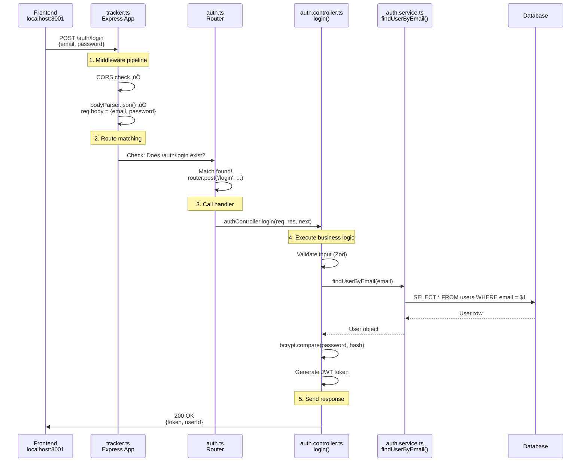

JamesSoh2000: How authRoutes defines '/login' in my project? Give me detailed explanation with examples to fully understand.

Workspace: Collecting workspace information# How `authRoutes` Defines `/login` - Deep Dive

Let me trace through your project to show you exactly how the `/login` route is defined and works.

---

## üìç Step 1: Route Registration in `tracker.ts`

In [tracker.ts](Money Tracking/Original Project/backend/src/tracker.ts), this line registers the auth routes:

```typescript
app.use('/auth', authRoutes);
```

**What this does:**
- Takes ALL routes defined in `authRoutes`
- Prefixes them with `/auth`
- Registers them with the Express app

**Visual analogy:**
```
authRoutes defines:     /login, /signup
                         ‚Üì
app.use('/auth', ...)    Adds '/auth' prefix
                         ‚Üì
Final URLs:             /auth/login, /auth/signup
```

---

## üìç Step 2: Route Definition in `auth.ts`

The actual `/login` route is defined in [backend/src/routes/auth.ts](Money Tracking/Original Project/backend/src/routes/auth.ts):

```typescript
import express from 'express';
import * as authController from '../controllers/auth.controller';

const router = express.Router();

// This creates the /login endpoint
router.post('/login', authController.login);
//     ‚Üë       ‚Üë              ‚Üë
//   Method  Path        Handler function

export default router;
```

**Breaking this down:**

### `router.post('/login', authController.login)`

**4 Key Parts:**

1. **`router.post`** = Only accept POST requests (not GET, PUT, DELETE)
   - Why POST? Because we're sending sensitive data (password) in request body
   - GET requests expose data in URLs (bad for passwords!)

2. **`'/login'`** = The path (route pattern)
   - This is a **relative** path
   - Combined with `/auth` prefix ‚Üí full path is `/auth/login`

3. **`authController.login`** = The handler function
   - This is a reference to a function defined in [`auth.controller.ts`](Money Tracking/Original Project/backend/src/controllers/auth.controller.ts)
   - Express calls this function when someone hits `POST /auth/login`

4. **No middleware** (compare to protected routes)
   - Login is PUBLIC (anyone can access)
   - Protected routes look like: `router.get('/transactions', isAuth, handler)`

---

## üìç Step 3: How the Complete URL is Built


**Step-by-step URL construction:**

1. **In tracker.ts:**
   ```typescript
   app.use('/auth', authRoutes);
   //       ‚Üë
   //  Base path prefix
   ```

2. **In auth.ts:**
   ```typescript
   router.post('/login', authController.login);
   //           ‚Üë
   //      Relative path
   ```

3. **Express combines them:**
   ```
   '/auth' + '/login' = '/auth/login'
   ```

4. **Full URL:**
   ```
   http://localhost:8000/auth/login
   ```

---

## üìç Step 4: The Handler Function (`authController.login`)

The actual logic lives in [`auth.controller.ts`](Money Tracking/Original Project/backend/src/controllers/auth.controller.ts):

```typescript
export const login = async (req: Request, res: Response, next: NextFunction) => {
    try {
        // 1. Validate request body
        const { email, password } = userSchema.parse(req.body);
        
        // 2. Find user in database
        const user = await authService.findUserByEmail(email);
        if (!user) {
            return res.status(401).json({ message: 'Invalid credentials.' });
        }
        
        // 3. Verify password
        const isEqual = await bcrypt.compare(password, user.password_hash);
        if (!isEqual) {
            return res.status(401).json({ message: 'Invalid credentials.' });
        }
        
        // 4. Generate JWT token
        const secret = process.env.JWT_SECRET;
        const token = jwt.sign(
            { userId: user.id, email: user.email },
            secret,
            { expiresIn: '1h' }
        );
        
        // 5. Send response
        return res.status(200).json({ token, userId: user.id });
        
    } catch (error) {
        next(error);
    }
};
```

**When is this function called?**

Only when someone sends a **POST** request to **`/auth/login`**

---

## 🔄 Complete Request Flow Example

Let's trace a real login request from start to finish:



---

## 🎯 Practical Examples

### Example 1: Adding a New Route

Let's say you want to add a **forgot password** endpoint:

**In auth.ts:**
```typescript
router.post('/forgot-password', authController.forgotPassword);
//           ‚Üë                    ‚Üë
//      New route path      New handler function
```

**What this creates:**
- Full URL: `POST /auth/forgot-password`
- Handler: Must create `forgotPassword` function in `auth.controller.ts`

---

### Example 2: Protected vs Public Routes

**Compare these two routes:**

**PUBLIC (in auth.ts):**
```typescript
router.post('/login', authController.login);
//                    ‚Üë
//            No middleware - anyone can access
```

**PROTECTED (in feed.ts):**
```typescript
router.get('/transactions', isAuth, feedController.getTransactions);
//                          ‚Üë
//                    Middleware runs FIRST
//                    (verifies JWT token)
```

**Difference:**
- `/auth/login` ‚Üí No token needed (how would you have one before logging in?)
- `/feed/transactions` ‚Üí Requires `Authorization: Bearer <token>` header

---

## üìä All Auth Routes in Your Project

From [auth.ts](Money Tracking/Original Project/backend/src/routes/auth.ts):

| Route Definition | Full URL | Method | Handler | Purpose |
|-----------------|----------|--------|---------|---------|
| `router.post('/signup', ...)` | `/auth/signup` | POST | `authController.signup` | Create new user |
| `router.post('/login', ...)` | `/auth/login` | POST | `authController.login` | Login existing user |

**Why only 2 routes?**

Authentication is intentionally simple:
- **Signup** = Create account
- **Login** = Get JWT token

Everything else (get user profile, change password, etc.) would go in different route files.

---

## üß™ Testing the Route

### Using cURL:

```bash
curl -X POST http://localhost:8000/auth/login \
  -H "Content-Type: application/json" \
  -d '{"email":"test@example.com","password":"password123"}'
```

**Expected response:**
```json
{
  "token": "eyJhbGciOiJIUzI1NiIsInR5cCI6IkpXVCJ9...",
  "userId": 1
}
```

### Using JavaScript (in browser console):

```javascript
fetch('http://localhost:8000/auth/login', {
    method: 'POST',
    headers: { 'Content-Type': 'application/json' },
    body: JSON.stringify({
        email: 'test@example.com',
        password: 'password123'
    })
})
.then(res => res.json())
.then(data => console.log(data));
```

### Using Postman:

1. Method: **POST**
2. URL: `http://localhost:8000/auth/login`
3. Headers: `Content-Type: application/json`
4. Body (raw JSON):
   ```json
   {
     "email": "test@example.com",
     "password": "password123"
   }
   ```

---

## üîç Common Patterns in Your Project

### Pattern 1: Route Organization

```
Routes are grouped by feature:
├── auth.ts → Authentication (/auth/signup, /auth/login)
├── feed.ts → Financial data (/feed/transactions, /feed/cashflow)
```

### Pattern 2: Middleware Application

```typescript
// PUBLIC routes (no middleware)
router.post('/login', authController.login);

// PROTECTED routes (with isAuth middleware)
router.get('/transactions', isAuth, feedController.getTransactions);
```

### Pattern 3: Controller Functions

All follow this signature:
```typescript
export const functionName = async (
    req: Request,       // Incoming request
    res: Response,      // Outgoing response
    next: NextFunction  // Pass errors to error handler
) => {
    try {
        // Business logic
        res.json({ ... });
    } catch (error) {
        next(error);  // Send to global error handler
    }
};
```

---

## ‚úÖ Quick Reference

**To add a new login-like route:**

1. **Define in [`auth.ts`](Money Tracking/Original Project/backend/src/routes/auth.ts):**
   ```typescript
   router.post('/new-route', authController.newHandler);
   ```

2. **Create handler in [`auth.controller.ts`](Money Tracking/Original Project/backend/src/controllers/auth.controller.ts):**
   ```typescript
   export const newHandler = async (req, res, next) => {
       // Your logic
   };
   ```

3. **Test:**
   ```
   POST /auth/new-route
   ```

---

## üéì Key Takeaways

1. **`app.use('/auth', authRoutes)`** ‚Üí Adds `/auth` prefix to all routes in `authRoutes`

2. **`router.post('/login', handler)`** ‚Üí Defines a route at `/login` (relative to prefix)

3. **Combined URL** ‚Üí `/auth` + `/login` = `/auth/login`

4. **Handler function** ‚Üí `authController.login` contains the actual business logic

5. **Request flow** ‚Üí tracker.ts ‚Üí auth.ts ‚Üí auth.controller.ts ‚Üí auth.service.ts ‚Üí database

Does this clarify how `/login` is defined? Would you like me to explain any specific part in more detail?