# Backend Foundation - Phase 2 Detailed Explanation

## The Optimal Prompt Used to Generate This Explanation

```
You are an expert backend developer educator specializing in teaching Node.js and TypeScript to beginners.

Create a comprehensive, end-to-end explanation of the Backend Foundation (Phase 2) for a Personal Finance Tracker project. The audience has basic TypeScript knowledge but limited backend experience.

**Components to Explain:**
1. package.json - Dependencies and scripts
2. tsconfig.json - TypeScript compiler configuration
3. Dockerfile - Containerization setup
4. tracker.ts - Main Express server entry point
5. db.ts - Database connection pool

**Explanation Structure Requirements:**

### Part 1: The Big Picture
- Start with an analogy that relates backend concepts to real-world scenarios
- Explain WHY we need a backend (not just HOW to build one)
- Show how all 5 components work together as a system
- Use a visual diagram showing the flow and relationships

### Part 2: Component-by-Component Breakdown
For each component, explain:
- **Purpose**: Why does this file exist? What problem does it solve?
- **Key Concepts**: What new concepts does the beginner need to understand?
- **Line-by-Line Analysis**: Walk through the actual code with annotations
- **Common Beginner Mistakes**: What typically confuses newcomers?
- **Testing**: How can they verify this component works?

### Part 3: How They Work Together
- Show the execution flow from start to finish
- Explain the dependency chain
- Provide a step-by-step boot sequence
- Include examples of requests flowing through the system

### Format Guidelines:
- Use simple language; avoid jargon or explain it immediately when used
- Include diagrams using Mermaid syntax for visual learners
- Provide "💡 Beginner Tip" callouts for important insights
- Add "⚠️ Common Pitfall" warnings for typical mistakes
- Use code examples with extensive comments
- End each section with "✅ Checkpoint" questions to verify understanding

**Tone**: Patient, encouraging, and thorough - assume the reader wants to TRULY understand, not just copy-paste code.
```

---

## Part 1: The Big Picture

### 🎯 Understanding the Backend with a Real-World Analogy

Imagine you're running a restaurant:

- **Frontend (React)** = The dining area where customers sit and order from menus
- **Backend (Express Server)** = The kitchen where chefs prepare food based on orders
- **Database (PostgreSQL)** = The pantry/storage where all ingredients (data) are kept
- **API Routes** = The waitstaff carrying orders from dining room to kitchen and bringing food back

When a customer (user) wants a meal (data), they can't just walk into the pantry and grab food themselves. They need to order through a waiter (API), who gives the order to the chef (backend logic), who retrieves ingredients from the pantry (database query), prepares the meal (processes data), and sends it back through the waiter to the customer.

**Why do we need this separation?**

1. **Security**: Users shouldn't directly access your database (imagine customers rummaging through your pantry!)
2. **Business Logic**: The kitchen can validate orders, check inventory, and apply restaurant rules
3. **Centralization**: Multiple dining areas (web, mobile app) can all use the same kitchen
4. **Data Integrity**: The kitchen ensures all orders are prepared correctly and safely

### 📊 System Architecture Diagram

```mermaid
graph TB
    subgraph "Your Computer / Docker Container"
        A[package.json<br/>📦 Dependencies List] -->|installs| B[node_modules<br/>📚 Library Code]
        C[tsconfig.json<br/>⚙️ Compiler Settings] -->|configures| D[TypeScript Compiler]
        E[src/tracker.ts<br/>🏢 Main Server] -->|compiles via| D
        F[src/db_conn/db.ts<br/>🔌 DB Connection] -->|compiles via| D
        D -->|produces| G[dist/tracker.js<br/>✅ Runnable JavaScript]
        H[Dockerfile<br/>📋 Build Instructions] -->|creates| I[Docker Image<br/>📦 Ready-to-Run Container]
        G -->|included in| I
    end
    
    subgraph "External World"
        J[PostgreSQL Database<br/>🗄️ Data Storage]
        K[Frontend React App<br/>🖥️ User Interface]
    end
    
    I -->|connects to| J
    I -->|serves API to| K
    
    style E fill:#4CAF50
    style F fill:#2196F3
    style G fill:#FF9800
    style I fill:#9C27B0
```



### 🔗 How All 5 Components Work Together

Here's the journey from "empty folder" to "running server":

1. **package.json** tells npm: "Install these libraries (Express, PostgreSQL client, etc.)"
2. **tsconfig.json** tells TypeScript: "Use these rules when converting `.ts` files to `.js`"
3. **tracker.ts** (written by you) creates the Express server and sets up routes
4. **db.ts** (written by you) creates a connection to PostgreSQL
5. **Dockerfile** tells Docker: "Here's how to build a container with Node.js, install dependencies, compile TypeScript, and start the server"

**🔄 The Build & Run Flow:**
```
Developer writes tracker.ts & db.ts (TypeScript)
         ↓
TypeScript Compiler (configured by tsconfig.json) 
         ↓
Converts to dist/tracker.js (JavaScript)
         ↓
Docker (using Dockerfile instructions)
         ↓
Runs: node dist/tracker.js
         ↓
Express server starts and listens on port 8000
```

---

## Part 2: Component-by-Component Breakdown

### 📦 Component 1: `package.json`

#### **Purpose: The Shopping List for Your Project**

Think of `package.json` as a shopping list for a recipe. It tells npm (Node Package Manager) exactly what libraries (ingredients) you need and what commands (cooking instructions) you can run.

#### **Full File Analysis:**

```json
{
  "name": "backend",                          // Project name
  "version": "1.0.0",                         // Version number (useful for tracking changes)
  "description": "",                          // Short description of what this project does
  "main": "./dist/tracker.js",               // Entry point - the first file to run
  
  "scripts": {
    // These are shortcuts for common commands. Run with: npm run <script-name>
    
    "test": "echo \"Error: no test specified\" && exit 1",    // Placeholder for tests
    
    "dev": "tsc -w & nodemon ./dist/tracker.js",
    // 💡 Development mode:
    //   - "tsc -w" = TypeScript compiler in WATCH mode (recompiles when files change)
    //   - "&" = runs both commands simultaneously
    //   - "nodemon ./dist/tracker.js" = Auto-restarts server when dist files change
    
    "start": "node ./dist/tracker.js",
    // 💡 Start the server (runs the compiled JavaScript)
    
    "build": "rimraf ./dist && tsc",
    // 💡 Production build:
    //   - "rimraf ./dist" = Delete the dist folder (clean slate)
    //   - "tsc" = Compile all TypeScript files to JavaScript
    
    "start:prod": "node ./dist/tracker.js"
    // 💡 Same as "start" - runs the compiled server
  },
  
  "author": "",                              // Your name
  "license": "ISC",                          // Open-source license type
  
  "devDependencies": {
    // 🛠️ Tools needed ONLY during development (not in production)
    
    "@types/bcryptjs": "^2.4.6",            // TypeScript type definitions for bcryptjs
    "@types/cors": "^2.8.19",               // TypeScript types for cors
    "@types/express": "^4.17.23",           // TypeScript types for Express
    "@types/jsonwebtoken": "^9.0.10",       // TypeScript types for JWT
    "@types/node": "^20.10.4",              // TypeScript types for Node.js built-ins
    "@types/pg": "^8.10.9",                 // TypeScript types for PostgreSQL client
    
    "jest": "^29.7.0",                      // Testing framework
    "nodemon": "^3.0.2",                    // Auto-restarts server on file changes
    "rimraf": "^5.0.5",                     // Cross-platform "rm -rf" (delete folders)
    "typescript": "^5.3.3"                  // The TypeScript compiler itself
  },
  
  "dependencies": {
    // 📚 Libraries needed IN PRODUCTION (shipped with your app)
    
    "bcryptjs": "^3.0.2",                   // Password hashing (security)
    "body-parser": "^1.20.2",               // Parses incoming JSON request bodies
    "cors": "^2.8.5",                       // Allows frontend to make requests from different origin
    "dotenv": "^16.5.0",                    // Loads environment variables from .env file
    "express": "^4.18.2",                   // The web server framework
    "jsonwebtoken": "^9.0.2",               // Creates/verifies JWT tokens for auth
    "pg": "^8.11.3",                        // PostgreSQL database client
    "zod": "^3.25.67"                       // Data validation library
  }
}
```

#### **Key Concepts for Beginners:**

**1. What's the difference between `dependencies` and `devDependencies`?**

- **dependencies**: Code your app needs to RUN in production (like Express, the database client)
- **devDependencies**: Tools you need to BUILD/TEST your app, but users don't need (like TypeScript compiler, type definitions)

**Example**: You need flour (dependency) to bake a cake, but you only need measuring cups (devDependency) while cooking - you don't serve the measuring cups with the cake!

**2. What do the `@types/*` packages do?**

TypeScript doesn't automatically know the "shape" of JavaScript libraries like Express. The `@types/express` package provides TypeScript with detailed information about Express's functions, so you get autocomplete and error checking.

```typescript
// WITHOUT @types/express - TypeScript has no idea what "express()" returns
const app = express();  // ❌ TypeScript error: Cannot find name 'express'

// WITH @types/express - TypeScript knows everything!
const app: Express = express();  // ✅ Full autocomplete and type safety!
```

**3. What's the `^` symbol in version numbers?**

`"express": "^4.18.2"` means: "Install version 4.18.2 or any newer MINOR update (like 4.19.0), but NOT major updates (like 5.0.0)."

- Major version (5.x.x) = Breaking changes
- Minor version (x.19.x) = New features, backward compatible
- Patch version (x.x.3) = Bug fixes only

#### **💡 Beginner Tips:**

1. **Install all dependencies** by running: `npm install` (reads package.json and downloads everything)
2. **Add a new library**: `npm install <package-name>` (automatically updates package.json)
3. **Run scripts**: `npm run dev`, `npm run build`, etc.

#### **⚠️ Common Pitfalls:**

- ❌ **Mistake**: Manually editing `node_modules` folder (where installed packages live)
  - ✅ **Fix**: Always use `npm install/uninstall` - never touch node_modules directly!

- ❌ **Mistake**: Forgetting to run `npm install` after cloning a project
  - ✅ **Fix**: Always run `npm install` first - it reads package.json and downloads all dependencies

#### **✅ Checkpoint Questions:**

1. Where would you add a new library that your app needs to run? (Answer: `dependencies`)
2. What command converts TypeScript to JavaScript? (Answer: `npm run build` which runs `tsc`)
3. What's the difference between `npm run dev` and `npm run start`? (Answer: `dev` auto-recompiles/restarts on file changes, `start` just runs once)

---

### ⚙️ Component 2: `tsconfig.json`

#### **Purpose: The Instruction Manual for the TypeScript Compiler**

When you write TypeScript code (`.ts` files), it must be converted to JavaScript (`.js` files) before Node.js can run it. The `tsconfig.json` file tells the TypeScript compiler HOW to do this conversion.

Think of it like a translator's style guide: Should they translate literally or adapt phrases? Include footnotes or strip them? This file controls all those decisions.

#### **Full File Analysis:**

```json
{
  "compilerOptions": {
    
    /* ========== BASIC OPTIONS ========== */
    
    "target": "es6",
    // 💡 What JavaScript version to output?
    //    "es6" = Modern JavaScript with arrow functions, classes, let/const
    //    Why: Node.js 14+ fully supports ES6
    
    "module": "commonjs",
    // 💡 How should imports/exports work?
    //    "commonjs" = Uses require() and module.exports (Node.js style)
    //    Alternative: "es2015" uses import/export (browser style)
    
    "lib": ["dom", "es6", "dom.iterable", "scripthost"],
    // 💡 Which built-in type definitions to include
    //    "es6" = Array.map(), Promise, etc.
    //    "dom" = window, document (useful if you ever render HTML from backend)
    
    "sourceMap": true,
    // 💡 Generate .map files for debugging
    //    Allows you to debug TypeScript code in browser dev tools (shows .ts not .js lines)
    
    "outDir": "./dist",
    // 💡 Where to put compiled JavaScript files
    //    📁 src/tracker.ts → 📁 dist/tracker.js
    
    "rootDir": "./src",
    // 💡 Where your TypeScript source files live
    //    Helps TypeScript maintain the same folder structure in dist/
    
    "removeComments": true,
    // 💡 Strip out comments from compiled JavaScript
    //    Makes output files smaller (production optimization)
    
    "noEmitOnError": true,
    // 💡 If there are TypeScript errors, DON'T create JavaScript files
    //    Prevents you from running broken code
    
    /* ========== STRICT TYPE-CHECKING ========== */
    
    "strict": true,
    // 💡 Enable ALL strict type checking rules
    //    Forces you to write safer code (catches bugs early)
    //    Includes: noImplicitAny, strictNullChecks, strictFunctionTypes, etc.
    
    /* ========== ADDITIONAL CHECKS ========== */
    
    "noUnusedLocals": true,
    // 💡 Error if you declare a variable but never use it
    //    Example: const x = 5;  // ❌ Error if 'x' is never referenced
    
    "noUnusedParameters": true,
    // 💡 Error if a function parameter is never used
    //    Example: function greet(name: string, age: number) { return name; }
    //             ❌ Error: 'age' is declared but never used
    
    "noImplicitReturns": true,
    // 💡 Error if some code paths in a function don't return a value
    //    Example:
    //      function getStatus(isActive: boolean): string {
    //        if (isActive) return 'active';
    //        // ❌ Error: Not all code paths return a value (missing 'else')
    //      }
    
    /* ========== MODULE RESOLUTION ========== */
    
    "baseUrl": "./",
    // 💡 Base directory for resolving non-relative imports
    //    Allows: import { query } from 'db_conn/db'
    //    Instead of: import { query } from '../../../db_conn/db'
    
    "esModuleInterop": true,
    // 💡 Makes importing libraries smoother
    //    Allows: import express from 'express'
    //    Instead of: import * as express from 'express'
    
    /* ========== EXPERIMENTAL ========== */
    
    "experimentalDecorators": true
    // 💡 Enables decorators (like @Controller in some frameworks)
    //    Example: @Route('/users') - adds metadata to classes
  },
  
  "exclude": [
    "node_modules"  // Don't try to compile libraries (they're already JavaScript)
  ]
}
```

#### **Key Concepts for Beginners:**

**1. What does the TypeScript compiler actually DO?**

It performs TWO jobs:

**Job 1: Type Checking** (catches errors BEFORE runtime)
```typescript
// tracker.ts
const port: number = "8000";  // ❌ TypeScript ERROR: Type 'string' is not assignable to type 'number'
```

**Job 2: Transpiling** (converts TypeScript to JavaScript)
```typescript
// INPUT: tracker.ts
const greet = (name: string): string => `Hello, ${name}!`;

// OUTPUT: dist/tracker.js (when target: "es6")
const greet = (name) => `Hello, ${name}!`;  // ← Types removed, code stays similar

// OUTPUT: dist/tracker.js (if target: "es5" for older browsers)
var greet = function(name) { return "Hello, " + name + "!"; };  // ← Uses old "var" and "function"
```

**2. Why separate `src/` and `dist/` folders?**

- **src/** = Your editable TypeScript source code (human-readable)
- **dist/** = Compiled JavaScript that Node.js actually runs (machine-readable)

This is like having both your recipe notes (src) and the final plated dish (dist). You edit the recipe, but you serve the dish.

**3. What's "strict mode" and why use it?**

```typescript
// WITHOUT "strict": true
function getUser(id) {  // ❌ TypeScript allows this! 'id' has type 'any' (unsafe)
  return id.toUpperCase();  // Runtime error if id is a number!
}

// WITH "strict": true
function getUser(id) {  // ❌ TypeScript ERROR: Parameter 'id' implicitly has an 'any' type.
  return id.toUpperCase();
}

// FIX: Add types
function getUser(id: string): string {  // ✅ Now TypeScript can verify it's used correctly!
  return id.toUpperCase();
}
```

Strict mode forces you to be explicit about types, preventing runtime bugs.

#### **💡 Beginner Tips:**

1. **Compile your code**: Run `tsc` (or `npm run build`) - it reads tsconfig.json automatically
2. **Watch mode**: Run `tsc -w` to auto-recompile whenever you save a .ts file
3. **Check for errors**: Run `tsc --noEmit` to type-check WITHOUT creating output files (useful for quick validation)

#### **⚠️ Common Pitfalls:**

- ❌ **Mistake**: Running `node src/tracker.ts` directly
  - ✅ **Fix**: Node.js can't run TypeScript! Always compile first: `npm run build`, then `node dist/tracker.js`

- ❌ **Mistake**: Editing files in `dist/` folder
  - ✅ **Fix**: ONLY edit `src/` files! The `dist/` folder is auto-generated (it gets overwritten on every build)

- ❌ **Mistake**: Ignoring TypeScript errors: "I'll fix them later"
  - ✅ **Fix**: `noEmitOnError: true` prevents compilation if errors exist - fix them NOW!

#### **✅ Checkpoint Questions:**

1. Where should you write your code - `src/` or `dist/`? (Answer: `src/`)
2. What command compiles TypeScript to JavaScript? (Answer: `tsc`)
3. What does `"strict": true` do? (Answer: Enables all type-safety checks to catch bugs early)

---

### 🐳 Component 3: `Dockerfile`

#### **Purpose: The Recipe for Building a Docker Container**

A Dockerfile is like a recipe card that tells Docker how to create a "container" - a lightweight, isolated environment where your backend runs.

**Why use Docker?**

Imagine you've built your app on your laptop (macOS), but your friend runs Windows, and production servers run Linux. Without Docker, you'd need to configure each environment differently ("It works on my machine!" problem).

Docker solves this by packaging your app + Node.js + all dependencies into a single "box" (container) that runs identically everywhere.

#### **Full File Analysis:**

```dockerfile
# ========== STEP 1: Choose a Base Image ==========
FROM node:14
# 💡 Start with an official Node.js v14 image from Docker Hub
#    This image already has Node.js and npm pre-installed
#    Like starting a recipe with "Use store-bought pie crust" instead of making from scratch

# ========== STEP 2: Set Working Directory ==========
WORKDIR /usr/src/app
# 💡 Create and move into this folder inside the container
#    All subsequent commands run here
#    Like saying "Work on the kitchen counter, not the floor"

# ========== STEP 3: Copy Dependency Files ==========
COPY package*.json ./
# 💡 Copy package.json and package-lock.json from your computer → container
#    The "*" wildcard catches both files
#    Why copy these FIRST (before other code)? See 💡 tip below!

# ========== STEP 4: Install Dependencies ==========
RUN npm install
# 💡 Inside the container, run: npm install
#    Downloads all libraries listed in package.json
#    Creates node_modules folder inside the container

# ========== STEP 5: Copy Application Code ==========
COPY . .
# 💡 Copy EVERYTHING from your project folder → container
#    (Except things listed in .dockerignore, like node_modules)

# ========== STEP 6: Compile TypeScript ==========
RUN npm run build
# 💡 Run the "build" script from package.json
#    Executes: rimraf ./dist && tsc
#    Creates the dist/ folder with compiled JavaScript

# ========== STEP 7: Expose Port ==========
EXPOSE 8000
# 💡 Document that this container listens on port 8000
#    Doesn't actually open the port (docker run -p does that)
#    Like putting a "OPEN" sign on a store door (informational)

# ========== STEP 8: Define Startup Command ==========
CMD npm run start:prod
# 💡 When the container starts, run: npm run start:prod
#    Which executes: node ./dist/tracker.js
#    This is the "main" process - if it stops, the container stops
```

#### **Key Concepts for Beginners:**

**1. What's the difference between `RUN` and `CMD`?**

- **RUN**: Executes during IMAGE BUILD (happens once when creating the container image)
  - Example: `RUN npm install` ← Downloads libraries once during build
  
- **CMD**: Executes when CONTAINER STARTS (happens every time you run the container)
  - Example: `CMD npm run start:prod` ← Starts the server every time you run the container

**Analogy:**
- `RUN` = Pre-cooking ingredients and storing them in the fridge (build time)
- `CMD` = Taking ingredients out and serving them (runtime)

**2. Why copy `package.json` BEFORE copying the rest of the code?**

Docker uses a layer cache. If you change `tracker.ts` but NOT `package.json`, Docker can SKIP re-running `npm install` (saves time!).

```dockerfile
# ❌ SLOW APPROACH (reinstalls dependencies every time ANY file changes)
COPY . .
RUN npm install
RUN npm run build

# ✅ FAST APPROACH (only reinstalls dependencies if package.json changes)
COPY package*.json ./   # Layer 1: Dependency files
RUN npm install          # Layer 2: Install (cached if package.json unchanged)
COPY . .                 # Layer 3: Application code
RUN npm run build        # Layer 4: Compile
```

**3. How do containers differ from virtual machines?**

| Virtual Machine | Docker Container |
|----------------|------------------|
| Includes full OS (Linux, Windows) | Shares host OS kernel |
| Boots in minutes | Starts in seconds |
| GBs in size | MBs in size |
| Runs on hypervisor (VMware, VirtualBox) | Runs on Docker Engine |

**Analogy**: VMs are like separate apartments (each with own utilities), containers are like rooms in a shared house (share plumbing/heating but isolated spaces).

#### **💡 Beginner Tips:**

1. **Build an image**: `docker build -t my-backend .` (creates a reusable template)
2. **Run a container**: `docker run -p 8000:8000 my-backend` (starts the server, maps port)
3. **List running containers**: `docker ps`
4. **Stop a container**: `docker stop <container-id>`

#### **⚠️ Common Pitfalls:**

- ❌ **Mistake**: Forgetting `.dockerignore` file → copies gigantic `node_modules` into container
  - ✅ **Fix**: Create `.dockerignore` with `node_modules` to exclude it (npm install happens INSIDE container)

- ❌ **Mistake**: Changing TypeScript code but seeing old behavior
  - ✅ **Fix**: Rebuild the image: `docker build -t my-backend .` (containers use stale images unless rebuilt)

- ❌ **Mistake**: Container starts then immediately stops
  - ✅ **Fix**: Check logs: `docker logs <container-id>` - likely your CMD is crashing

#### **✅ Checkpoint Questions:**

1. What does `FROM node:14` do? (Answer: Uses a pre-built image with Node.js installed)
2. When does `RUN npm install` execute? (Answer: During image build)
3. When does `CMD npm run start:prod` execute? (Answer: Every time the container starts)

---

### 🏢 Component 4: `tracker.ts` (Main Express Server)

#### **Purpose: The Heart of Your Backend - The HTTP Server**

This file creates and configures the Express server - the "engine" that listens for HTTP requests from your frontend, processes them, and sends responses back.

**What does Express do?**

Express is a web framework that simplifies building HTTP servers. Without it, you'd need to manually parse incoming requests, route URLs, handle errors - Express does this for you!

**Analogy**: Express is like a restaurant manager who:
- Greets customers (receives requests)
- Directs them to the right waiter (routing)
- Handles complaints (error handling)
- Ensures orders are formatted correctly (middleware)

#### **Full File Analysis:**

```typescript
// ========== IMPORTS ==========
import express, { Express, Request, Response, NextFunction } from 'express';
// 💡 Import Express and TypeScript types for:
//    - Express: The main app type
//    - Request: Incoming HTTP request
//    - Response: Outgoing HTTP response
//    - NextFunction: Passes control to next middleware

import bodyParser from 'body-parser';
// 💡 Parses incoming JSON data from request bodies
//    Example: POST request with { "email": "user@example.com" }
//    Body-parser converts raw text → JavaScript object

import cors from 'cors';
// 💡 Enables Cross-Origin Resource Sharing
//    Allows your React app (http://localhost:3001) to make requests to this backend (http://localhost:8000)
//    Without CORS, browsers block requests between different origins (security feature)

import { z } from 'zod';
// 💡 Validation library (used in error handling later)

import feedRoutes from './routes/feed';
// 💡 Import routes for data endpoints (transactions, analytics)

import authRoutes from './routes/auth';
// 💡 Import routes for authentication (login, signup)

// ========== CONFIGURATION ==========
const port = process.env.PORT || 8000;
// 💡 Read port from environment variable, default to 8000
//    Environment variables are set in docker-compose.yaml or .env file
//    Allows different ports in dev (8000) vs production (maybe 80)

const app: Express = express();
// 💡 Create an Express application instance
//    'app' is the server object - you'll configure it and start it

// ========== MIDDLEWARE SETUP ==========
// Middleware = Functions that run BEFORE your route handlers
// They can modify requests, check authentication, parse data, etc.

app.use(cors({
    origin: "*",  
    // 💡 Allow requests from ANY origin (frontend URL)
    //    "*" = Allow all (permissive - use specific URLs in production!)
    //    Example: origin: "http://localhost:3001"
    
    methods: "GET,HEAD,PUT,PATCH,POST,DELETE",
    // 💡 Which HTTP methods are allowed
    //    GET = Read data
    //    POST = Create data
    //    PUT/PATCH = Update data
    //    DELETE = Delete data
    
    preflightContinue: false,
    optionsSuccessStatus: 204
    // 💡 Technical details for handling CORS "preflight" requests
    //    (Browsers send OPTIONS request before actual request to check permissions)
}));

app.use(bodyParser.json());
// 💡 Parse incoming requests with JSON payloads
//    Converts: '{"username":"alice"}' (raw text in request body)
//    Into: req.body = { username: "alice" } (JavaScript object)

// ========== ROUTE REGISTRATION ==========
app.use('/auth', authRoutes);
// 💡 All routes defined in 'authRoutes' are prefixed with '/auth'
//    Example: If authRoutes defines '/login', the full path is: http://localhost:8000/auth/login

app.use('/feed', feedRoutes);
// 💡 All routes in 'feedRoutes' are prefixed with '/feed'
//    Example: /feed/transaction, /feed/cashflow, etc.

// ========== GLOBAL ERROR HANDLER ==========
app.use((error: any, _req: Request, res: Response, _next: NextFunction) => {
    // 💡 This middleware fires when ANY route throws an error
    //    The 4 parameters (error, req, res, next) signal to Express: "I'm an error handler"
    //    "_req" and "_next" prefix with '_' means "I'm not using these" (avoids TypeScript warnings)
    
    console.error(error);
    // 💡 Log the error to console (helps with debugging)
    
    if (error instanceof z.ZodError) {
        // 💡 Special handling for validation errors (from Zod library)
        //    Example: User sent { email: "invalid" } but we expect a valid email format
        
        res.status(422).json({ 
            message: 'Validation failed.',
            errors: error.errors 
            // 💡 Send detailed error info: which fields failed, why
        });
        return;
    }
    
    // 💡 For all other errors, send a generic response
    const status = error.statusCode || 500;
    // 💡 Use error's status code if it has one, otherwise 500 (Internal Server Error)
    
    const message = error.message || 'An internal server error occurred.';
    // 💡 Use error's message if available, otherwise generic message
    
    res.status(status).json({ message: message });
    // 💡 Send JSON response: { "message": "Error description" }
    
    return;
});

// ========== START THE SERVER ==========
app.listen(port, () => {
    // 💡 Tell Express to start listening for HTTP requests on the specified port
    //    "port 8000" means: http://localhost:8000
    
    console.log(`Server is running on port ${port}`);
    // 💡 Print confirmation message (proves server started successfully)
});
```

#### **Key Concepts for Beginners:**

**1. What is middleware and how does it work?**

Imagine incoming requests flow through a pipeline:

```
Incoming Request
       ↓
   [CORS Middleware] ← Checks if request origin is allowed
       ↓
   [Body Parser] ← Converts JSON text → JavaScript object
       ↓
   [Route Handler] ← Your code: '/auth/login', '/feed/transaction', etc.
       ↓
   [Error Handler] ← Catches any errors from above
       ↓
Outgoing Response
```

**Example flow for POST /auth/login:**
```typescript
// 1. CORS middleware runs
//    ✅ Origin 'http://localhost:3001' is allowed

// 2. Body-parser middleware runs
//    Converts: '{"email":"alice@example.com","password":"secret"}'
//    Into: req.body = { email: "alice@example.com", password: "secret" }

// 3. Route handler runs (authRoutes → /login)
//    Your code: Check if user exists, validate password, return JWT

// 4. Response sent back to frontend
//    { "token": "eyJhbGciOiJIUzI1NiIsInR5cCI6IkpXVCJ9..." }
```

**2. What are HTTP status codes?**

Status codes tell the client whether the request succeeded:

| Code | Meaning | Example |
|------|---------|---------|
| 200 | OK | Successfully retrieved data |
| 201 | Created | Successfully created a new record |
| 400 | Bad Request | Missing required fields |
| 401 | Unauthorized | Invalid login credentials |
| 404 | Not Found | Endpoint doesn't exist |
| 422 | Unprocessable Entity | Validation failed (Zod errors) |
| 500 | Internal Server Error | Server crashed/bug |

**3. What's the difference between `app.use()` and `app.get()`?**

```typescript
// app.use() = Applies to ALL routes and ALL HTTP methods
app.use(bodyParser.json());  // ← Runs for GET, POST, PUT, DELETE, etc.

// app.get() = Only handles GET requests to a specific path
app.get('/users', (req, res) => { ... });  // ← Only runs for: GET /users
```

#### **💡 Beginner Tips:**

1. **Test if server is running**: Visit http://localhost:8000 in your browser
2. **Debug middleware order**: Middleware runs TOP-TO-BOTTOM, so order matters!
   ```typescript
   // ❌ WRONG ORDER - routes run before body-parser
   app.use('/auth', authRoutes);
   app.use(bodyParser.json());
   
   // ✅ CORRECT ORDER - body-parser runs first
   app.use(bodyParser.json());
   app.use('/auth', authRoutes);
   ```

3. **Add a basic health check endpoint**:
   ```typescript
   app.get('/health', (req, res) => {
     res.status(200).json({ status: 'OK', timestamp: new Date() });
   });
   ```
   Visit http://localhost:8000/health to verify server is alive

#### **⚠️ Common Pitfalls:**

- ❌ **Mistake**: Forgetting `return` after `res.json()` in error handler
  - ✅ **Fix**: Always `return` after sending a response, or Express continues running code!

- ❌ **Mistake**: CORS errors: "Access-Control-Allow-Origin missing"
  - ✅ **Fix**: Make sure `app.use(cors())` comes BEFORE route registration

- ❌ **Mistake**: `req.body` is undefined
  - ✅ **Fix**: Make sure `app.use(bodyParser.json())` is present AND you're sending `Content-Type: application/json` header

#### **✅ Checkpoint Questions:**

1. What does `app.listen(8000)` do? (Answer: Starts the server and listens for requests on port 8000)
2. What does CORS middleware do? (Answer: Allows frontend (different origin) to make requests to backend)
3. What's the purpose of `bodyParser.json()`? (Answer: Parses incoming JSON request bodies into JavaScript objects)

---

### 🔌 Component 5: `db.ts` (Database Connection Pool)

#### **Purpose: The Bridge Between Your Server and PostgreSQL Database**

This file creates a reusable database connection that your backend uses to run SQL queries. Instead of opening/closing a connection for every query (slow!), it maintains a "pool" of ready-to-use connections.

**Analogy**: Imagine a call center with multiple phone lines. Instead of plugging/unplugging phones for each call, you keep several lines active. When someone needs to call, they grab an available line from the "pool", make the call, then return it.

#### **Full File Analysis:**

```typescript
// ========== IMPORTS ==========
import { Pool, QueryResult } from 'pg';
// 💡 Import from 'pg' (node-postgres library)
//    - Pool: Manages multiple database connections
//    - QueryResult: TypeScript type for query responses

// ========== CREATE CONNECTION POOL ==========
const pool = new Pool({
    // 💡 Create a pool of connections to PostgreSQL
    //    Default pool size: 10 connections (configurable)
    
    user: process.env.POSTGRES_USER,
    // 💡 Database username (from environment variables)
    //    Example: 'postgres' or custom user like 'tracker_admin'
    //    Why env variables? So you don't hardcode secrets in code!
    
    host: process.env.POSTGRES_HOST,
    // 💡 Database server address
    //    Local development: 'localhost' or '127.0.0.1'
    //    Docker: 'postgres' (service name from docker-compose.yaml)
    //    Production: 'db.example.com' or IP address
    
    database: 'tracker',
    // 💡 Which database to connect to
    //    PostgreSQL can host multiple databases; we're using 'tracker'
    //    This must match the database created in your migrations
    
    password: process.env.POSTGRES_PASSWORD,
    // 💡 Password for the database user
    //    ⚠️ NEVER hardcode! Always use environment variables
    
    port: 5432,
    // 💡 PostgreSQL's default port
    //    Like how HTTP uses port 80, PostgreSQL uses 5432
});

// ========== EXPORT QUERY FUNCTION ==========
export const query = (text: string, params?: any[]): Promise<QueryResult> => {
    // 💡 This function is your "universal database query tool"
    //    You'll import and use this throughout your backend:
    //    import { query } from './db_conn/db';
    
    // PARAMETERS EXPLAINED:
    // - text: The SQL query (string)
    // - params: Values to substitute into the query (optional array)
    // - Returns: Promise<QueryResult> (resolves with query results)
    
    return pool.query(text, params || []);
    // 💡 Execution flow:
    //    1. pool.query() grabs an available connection from the pool
    //    2. Runs the SQL query
    //    3. Returns the connection to the pool (for reuse)
    //    4. Returns a Promise with the results
};
```

#### **Key Concepts for Beginners:**

**1. What is a connection pool and why use it?**

**Without pooling (slow ❌):**
```typescript
// Every query opens a NEW connection
async function getUser(id: number) {
  const client = new Client({ user: '...', host: '...', ... });
  await client.connect();         // ← SLOW (network handshake)
  const result = await client.query('SELECT * FROM users WHERE id = $1', [id]);
  await client.end();             // ← Close connection
  return result;
}
// If you run this 100 times, you open/close 100 connections!
```

**With pooling (fast ✅):**
```typescript
// Pool maintains 10 ready-to-use connections
const pool = new Pool({ ... });

async function getUser(id: number) {
  // Grab an existing connection from pool (instant!)
  const result = await pool.query('SELECT * FROM users WHERE id = $1', [id]);
  // Connection automatically returned to pool for reuse
  return result;
}
// Running this 100 times reuses the same 10 connections
```

**Benefits:**
- ⚡ Faster (no connection setup overhead)
- 💪 Handles concurrent requests (multiple users at once)
- 🛡️ Prevents connection leaks (pool manages cleanup)

**2. What are parameterized queries (`$1`, `$2`, etc.)?**

**❌ DANGEROUS (SQL Injection vulnerability):**
```typescript
const email = userInput;  // User types: bob@example.com' OR '1'='1
const query = `SELECT * FROM users WHERE email = '${email}'`;
//                                                  ^^^^^^^^
// Resulting query: SELECT * FROM users WHERE email = 'bob@example.com' OR '1'='1'
// ❌ OR '1'='1' is ALWAYS true → returns ALL users! (security breach)
```

**✅ SAFE (parameterized query):**
```typescript
const email = userInput;  // User types: bob@example.com' OR '1'='1
const result = await pool.query(
  'SELECT * FROM users WHERE email = $1',  // $1 = placeholder
  [email]                                  // [ "bob@example.com' OR '1'='1" ]
);
// PostgreSQL treats the entire input as a STRING (not SQL code)
// Query searches for literal email: "bob@example.com' OR '1'='1" (finds nothing - safe!)
```

**How placeholders work:**
```typescript
// Example with multiple parameters
const result = await query(
  'INSERT INTO transactions (user_id, amount, category, date) VALUES ($1, $2, $3, $4)',
  [userId, 150.50, 'Food', '2024-01-15']
);
//      ↑       ↑      ↑           ↑
//     $1      $2     $3          $4
```

**3. What does `process.env` do?**

`process.env` reads environment variables - settings stored OUTSIDE your code.

**Where are they defined?**

**For Docker (docker-compose.yaml):**
```yaml
services:
  backend:
    environment:
      POSTGRES_USER: tracker_user
      POSTGRES_PASSWORD: securepassword123
      POSTGRES_HOST: postgres  # ← Docker service name
```

**For local development (.env file):**
```
POSTGRES_USER=tracker_user
POSTGRES_PASSWORD=securepassword123
POSTGRES_HOST=localhost
```

**Why use environment variables?**

✅ Security: Don't commit passwords to Git
✅ Flexibility: Different values in dev vs production
✅ Standard practice: All cloud platforms use them

#### **💡 Beginner Tips:**

1. **Test the connection**: Add this to tracker.ts (temporarily):
   ```typescript
   import { query } from './db_conn/db';
   
   query('SELECT NOW()').then(result => {
     console.log('Database connected! Current time:', result.rows[0]);
   }).catch(err => {
     console.error('Database connection failed:', err);
   });
   ```

2. **Common query patterns**:
   ```typescript
   // SELECT (read data)
   const users = await query('SELECT * FROM users');
   console.log(users.rows);  // Array of user objects
   
   // INSERT (create data)
   const newUser = await query(
     'INSERT INTO users (email, password) VALUES ($1, $2) RETURNING *',
     ['alice@example.com', 'hashed_password']
   );
   console.log(newUser.rows[0]);  // The newly created user
   
   // UPDATE (modify data)
   await query('UPDATE users SET email = $1 WHERE id = $2', ['new@example.com', 5]);
   
   // DELETE (remove data)
   await query('DELETE FROM transactions WHERE id = $1', [123]);
   ```

3. **Pool lifecycle**: The pool stays alive as long as your server runs - no need to close it manually

#### **⚠️ Common Pitfalls:**

- ❌ **Mistake**: Hardcoding database credentials
  ```typescript
  const pool = new Pool({
    user: 'tracker_user',         // ❌ Commits password to Git!
    password: 'secret123',
  });
  ```
  - ✅ **Fix**: Use `process.env.POSTGRES_PASSWORD`

- ❌ **Mistake**: Using string concatenation for queries
  ```typescript
  const id = req.params.id;
  await query(`SELECT * FROM users WHERE id = ${id}`);  // ❌ SQL injection risk!
  ```
  - ✅ **Fix**: Use parameterized queries: `query('SELECT * FROM users WHERE id = $1', [id])`

- ❌ **Mistake**: Environment variables not loading
  - ✅ **Fix**: 
    - Make sure `.env` file exists and has no typos
    - Import `dotenv` in tracker.ts: `import 'dotenv/config';` (before using process.env)
    - In Docker, check `docker-compose.yaml` has correct `environment:` section

#### **✅ Checkpoint Questions:**

1. Why use a connection pool instead of creating new connections? (Answer: Faster, reuses connections, handles concurrency)
2. What does `$1` mean in SQL queries? (Answer: Placeholder for parameterized query - prevents SQL injection)
3. Where should database passwords be stored? (Answer: Environment variables, never hardcoded in code)

---

## Part 3: How They All Work Together

### 🔄 The Complete Boot Sequence

Let's trace what happens when you run `docker-compose up`:


### 📋 Step-by-Step Execution Flow

#### **Phase 1: Docker Build (Happens once when image is created)**

1. **Dockerfile Line 2**: `FROM node:14`
   - Docker downloads Node.js v14 base image (if not cached)
   - Now you have a Linux environment with Node.js pre-installed

2. **Dockerfile Line 8**: `COPY package*.json ./`
   - Copies package.json and package-lock.json into container
   - Purpose: Install dependencies before copying code (cache optimization)

3. **Dockerfile Line 11**: `RUN npm install`
   - Reads package.json
   - Downloads Express, pg, cors, TypeScript, etc. into node_modules
   - Downloads @types/* for TypeScript support

4. **Dockerfile Line 14**: `COPY . .`
   - Copies all source code (src/tracker.ts, src/db_conn/db.ts, etc.) into container

5. **Dockerfile Line 15**: `RUN npm run build`
   - Executes: `rimraf ./dist && tsc`
   - tsconfig.json tells TypeScript compiler:
     - Read .ts files from `src/`
     - Compile to JavaScript
     - Output to `dist/` folder
   - Result: dist/tracker.js, dist/db_conn/db.js created

#### **Phase 2: Container Startup (Happens every time you run the container)**

6. **Dockerfile Line 21**: `CMD npm run start:prod`
   - Docker runs: `node ./dist/tracker.js`
   - This is the compiled JavaScript version of tracker.ts

#### **Phase 3: Application Initialization (Inside tracker.ts)**

7. **Line 1-8**: Import dependencies
   ```typescript
   import express from 'express';
   import bodyParser from 'body-parser';
   import cors from 'cors';
   // Node.js loads these modules from node_modules
   ```

8. **Line 11**: `const app: Express = express();`
   - Creates the Express application instance
   - This is your server object

9. **Lines 13-20**: Configure middleware
   ```typescript
   app.use(cors({ origin: "*" }));      // Enable cross-origin requests
   app.use(bodyParser.json());          // Parse JSON request bodies
   ```

10. **Lines 22-23**: Register routes
    ```typescript
    app.use('/auth', authRoutes);   // Handle /auth/login, /auth/signup, etc.
    app.use('/feed', feedRoutes);   // Handle /feed/transaction, /feed/cashflow, etc.
    ```

11. **Lines 25-40**: Set up error handler
    - Catches any errors from route handlers
    - Sends appropriate HTTP status codes and messages

12. **Lines 42-44**: Start the server
    ```typescript
    app.listen(8000, () => {
        console.log(`Server is running on port 8000`);
    });
    ```
    - Express starts listening for HTTP requests
    - Server is now ACTIVE and waiting for incoming requests

#### **Phase 4: Database Connection (Inside db.ts)**

13. **Lines 3-9**: Create connection pool
    ```typescript
    const pool = new Pool({
        user: process.env.POSTGRES_USER,     // From docker-compose environment
        host: process.env.POSTGRES_HOST,     // 'postgres' (Docker service name)
        database: 'tracker',
        password: process.env.POSTGRES_PASSWORD,
        port: 5432,
    });
    ```
    - Creates 10 ready-to-use database connections
    - Connections stay open throughout server lifetime

14. **Lines 11-13**: Export query function
    ```typescript
    export const query = (text, params) => pool.query(text, params || []);
    ```
    - Other files import this function to run SQL queries

### 🌐 Example: Handling an Incoming Request

Let's trace a real request: **User clicks "Login" button**

```mermaid
sequenceDiagram
    participant Frontend as React App<br/>(localhost:3001)
    participant CORS as CORS Middleware
    participant BodyParser as Body-Parser
    participant Router as Express Router
    participant AuthController as Auth Controller
    participant DB as Database Pool
    participant Postgres as PostgreSQL

    Frontend->>CORS: POST /auth/login<br/>{ email, password }
    
    Note over CORS: Check Origin Header
    CORS->>CORS: Origin: http://localhost:3001
    CORS->>CORS: ✅ Allowed (origin: "*")
    
    CORS->>BodyParser: Request passes
    
    Note over BodyParser: Parse Request Body
    BodyParser->>BodyParser: Content-Type: application/json
    BodyParser->>BodyParser: Parse: '{"email":"alice@example.com",...}'
    BodyParser->>BodyParser: Set: req.body = { email: "...", password: "..." }
    
    BodyParser->>Router: Request passes
    
    Note over Router: Match Route
    Router->>Router: Path: /auth/login
    Router->>Router: Method: POST
    Router->>AuthController: ✅ Found handler
    
    Note over AuthController: Execute Route Logic
    AuthController->>DB: query('SELECT * FROM users WHERE email = $1', [email])
    DB->>Postgres: Execute SQL query
    Postgres-->>DB: Return user row
    DB-->>AuthController: { rows: [{ id: 5, email: "...", password_hash: "..." }] }
    
    AuthController->>AuthController: Compare password with hash
    AuthController->>AuthController: Generate JWT token
    
    AuthController->>Frontend: 200 OK<br/>{ token: "eyJhbGci..." }
    
    Note over Frontend: Store token, redirect to dashboard
```



**Detailed Request Flow:**

1. **Frontend sends request**:
   ```javascript
   fetch('http://localhost:8000/auth/login', {
     method: 'POST',
     headers: { 'Content-Type': 'application/json' },
     body: JSON.stringify({ email: 'alice@example.com', password: 'secret123' })
   })
   ```

2. **Request reaches Express server** → Enters middleware pipeline

3. **CORS middleware** (line 13 in tracker.ts):
   - Checks: Is `Origin: http://localhost:3001` allowed?
   - ✅ Yes (we set `origin: "*"`)
   - Adds response headers: `Access-Control-Allow-Origin: *`

4. **Body-parser middleware** (line 20 in tracker.ts):
   - Reads raw request body (JSON string)
   - Parses it into JavaScript object
   - Sets: `req.body = { email: "alice@example.com", password: "secret123" }`

5. **Router matches path** (line 22 in tracker.ts):
   - Request path: `/auth/login`
   - Matches: `app.use('/auth', authRoutes)`
   - Looks for `/login` handler inside `authRoutes`

6. **Auth controller executes** (in auth.controller.ts):
   ```typescript
   import { query } from '../db_conn/db';  // Import our query function
   
   const result = await query(
     'SELECT * FROM users WHERE email = $1',
     [req.body.email]
   );
   ```

7. **Database query** (db.ts executes):
   - `pool.query()` grabs an available connection
   - Sends SQL to PostgreSQL: `SELECT * FROM users WHERE email = 'alice@example.com'`
   - PostgreSQL returns user row
   - Connection returns to pool

8. **Auth controller validates password**:
   - Compares `req.body.password` with stored hash
   - If match: Generate JWT token
   - If no match: Throw error (caught by error handler)

9. **Response sent back**:
   ```typescript
   res.status(200).json({ token: "eyJhbGciOiJIUzI1NiIsInR5cCI6IkpXVCJ9..." });
   ```

10. **Frontend receives response**:
    - Stores token in localStorage
    - Redirects to dashboard

### 🧩 Dependency Chain

Here's what depends on what:


**Build Order (you must follow this sequence):**

1. ✅ **Create package.json** → Defines what to install
2. ✅ **Run `npm install`** → Downloads dependencies
3. ✅ **Create tsconfig.json** → Configures compiler
4. ✅ **Write tracker.ts & db.ts** → Application code
5. ✅ **Run `npm run build`** → Compiles TypeScript
6. ✅ **Create Dockerfile** → Defines container build steps
7. ✅ **Run `docker build`** → Creates image
8. ✅ **Run `docker run`** or `docker-compose up` → Starts container

### 💡 Key Takeaways

| Component | Purpose | When It Runs | Output |
|-----------|---------|--------------|--------|
| **package.json** | Lists dependencies and scripts | Read by `npm install` | node_modules folder |
| **tsconfig.json** | Configures TypeScript compiler | Read by `tsc` command | Compiler settings |
| **Dockerfile** | Defines container build steps | Read by `docker build` | Docker image |
| **tracker.ts** | Main server logic | Compiled to dist/tracker.js, then run by Node.js | Running HTTP server |
| **db.ts** | Database connection | Imported by other files, creates pool on load | Query function |

---

## 🎓 Final Comprehensive Checkpoint

Test your understanding with these questions:

### Easy Questions:
1. What command installs all dependencies? (Answer: `npm install`)
2. What folder contains compiled JavaScript? (Answer: `dist/`)
3. What port does the server listen on? (Answer: 8000)
4. What does CORS stand for? (Answer: Cross-Origin Resource Sharing)

### Medium Questions:
5. Why copy `package.json` before application code in Dockerfile? (Answer: Cache optimization - dependencies don't change often)
6. What's the difference between `dependencies` and `devDependencies`? (Answer: dependencies = production, devDependencies = development only)
7. How do you prevent SQL injection? (Answer: Use parameterized queries with $1, $2 placeholders)

### Advanced Questions:
8. What happens if you remove `"strict": true` from tsconfig.json? (Answer: TypeScript allows unsafe code like implicit 'any' types)
9. Why use a connection pool instead of new Client() for each query? (Answer: Performance - reuses connections, handles concurrency)
10. Trace the request flow for GET /feed/cashflow from frontend → database → response (Answer: See "Example: Handling an Incoming Request" section)

---

## 🚀 Next Steps

Now that you understand Phase 2, you can:

1. **Experiment**: Modify tracker.ts to add a new `/health` endpoint
2. **Practice**: Write a function in db.ts to query all users
3. **Debug**: Add `console.log()` statements to trace request flow
4. **Move Forward**: Proceed to Phase 3 (Authentication System) in your roadmap

## 📚 Additional Resources

- [Express.js Official Docs](https://expressjs.com/)
- [TypeScript Handbook](https://www.typescriptlang.org/docs/handbook/intro.html)
- [node-postgres (pg) Documentation](https://node-postgres.com/)
- [Docker Getting Started](https://docs.docker.com/get-started/)

---

**Congratulations!** You now have a solid understanding of the Backend Foundation. Keep this document as a reference, and don't hesitate to revisit specific sections as you build your application! 🎉
